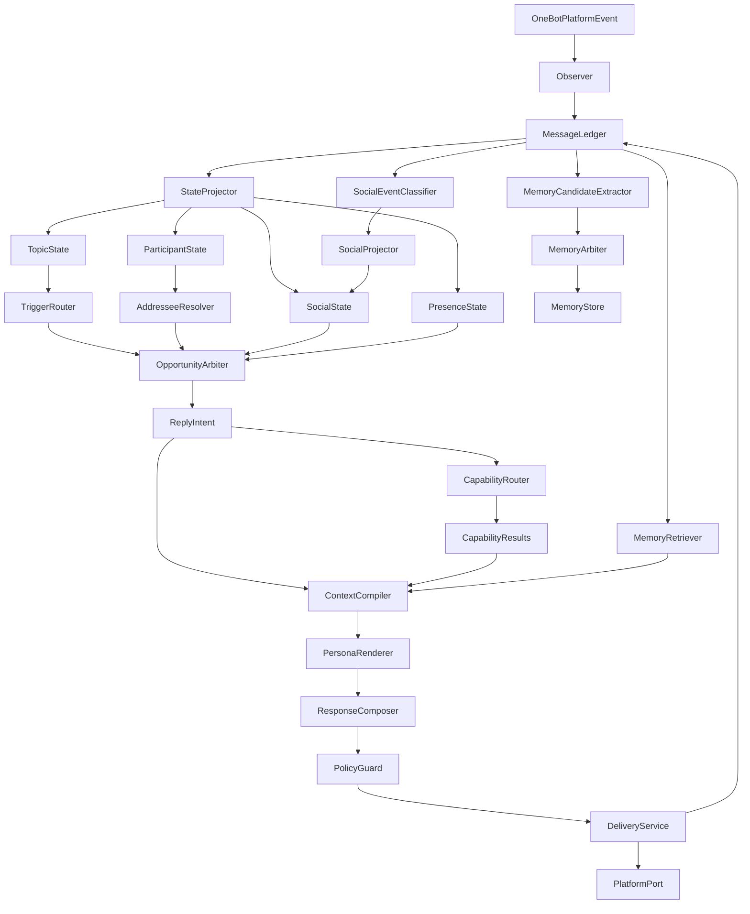
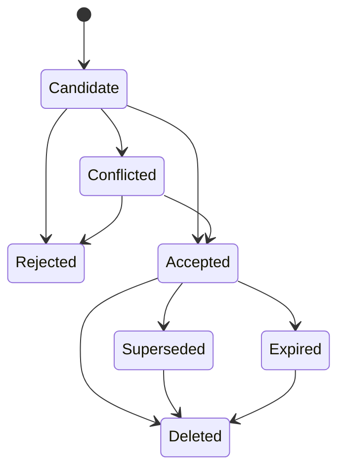
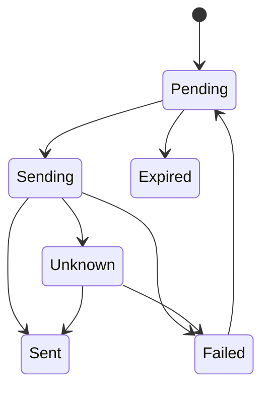

# Groupmate V3 总体架构规范与实施总计划

日期：2026-07-24<br>
状态：目标态规范，Phase 0-5 已实现，Phase 6+ 待实施<br>
规范版本：3.0.0-draft<br>
当前实现基线：Groupmate V3 Phase 5（能力层前）<br>
当前迁移进度：V3 Phase 0-5 已完成；Phase 6 未开始

前置文档：

- `docs/superpowers/specs/2026-07-22-groupmate-v2-architecture.md`
- `docs/superpowers/specs/2026-07-24-companion-core.md`

本文同时承担两项职责：

1. 定义 Groupmate 成熟体系的唯一目标架构；
2. 给出从当前实现迁移到目标架构的可执行阶段计划。

后续实现不得仅凭本文标题或阶段摘要猜测设计；必须遵守对应章节的领域契约、不变式、迁移门槛和回滚要求。

---

## 1. 产品目标与边界

### 1.1 产品目标

Groupmate 是宿主无关、人格可替换的群聊伙伴运行时。第一产品人格为爱弥斯。

成熟体系必须支持：

1. 持续观察群消息，不因暂停回复、模型调用或发送延迟丢失上下文；
2. 可靠响应原生 `@`、回复 Bot、句首别名和有界续聊；
3. 在未被直接叫到时，仅在有明确价值且打断成本较低时自然接话；
4. 理解多人话题中的说话人、被指向者、回复链和当前话题；
5. 保持短句、点名、接梗、自然进退等群聊节奏；
6. 保持爱弥斯独立身份，不复刻学习素材中的角色设定；
7. 记住有限、公开、稳定且可追溯的信息；
8. 支持表情包、视觉、外部知识、统计和受限子智能体扩展；
9. 统一处理文本、多模态、异步任务结果和未来主动消息；
10. 所有决策均可审计、回放、评测、删除、迁移和回滚。

### 1.2 风格学习边界

`学习素材/chat_text.txt` 仅作为群聊节奏与场景结构的参考：

- 可学习：短句、点名、接梗、多人上下文、适度关心、自然拒绝、少量口语停顿；
- 不学习：小维名称、花房世界观、固定口癖、泛称哥哥姐姐、虚构日常和原句照抄；
- 不直接把原始聊天记录作为 Persona few-shot；
- 评测样本必须脱敏并改写为爱弥斯语境。

### 1.3 明确非目标

V3 不以以下能力为目标：

- 通用自主 Agent 操作系统；
- Agent Mesh、Kanban、MCP 或复杂审批中心；
- 无筛选保存全部群聊为长期记忆；
- 默认跨群关联同一用户；
- 公开可刷榜的好感度数值；
- 让子智能体直接发消息或修改长期状态；
- 通过虚构现实生活经历制造“真人身份”；
- 在数据证明必要前引入向量数据库；
- 在统一 Delivery、隐私治理和 kill switch 完成前启用真主动消息；
- 为追求人味而提高无价值插话频率。

---

## 2. 规范语言与核心原则

本文使用以下规范词：

- **必须**：实现不得违反；
- **禁止**：任何实现路径均不得发生；
- **应该**：除非有记录充分的例外；
- **可以**：可选实现，不构成兼容承诺。

### 2.1 核心原则

1. **事实先于推断**：原始事件、平台回执和人工配置高于模型推断；
2. **观察与回复正交**：Observer 永不等待 LLM、拟人延迟或平台发送；
3. **决策与表达分离**：是否说、对谁说、为何说，不由 Persona 自行猜测；
4. **能力不直接发送**：所有能力只返回结构化结果；
5. **Delivery 独占发送权**：任何对外消息都走同一发送闭包；
6. **主 Persona 独占最终表达**：能力和子智能体不得把报告原文直接发群；
7. **状态只有一个权威写入者**：禁止同一状态由两个模块无仲裁更新；
8. **投影可重建**：Session、Topic、续聊和限流不作为不可恢复的真相源；
9. **软触发默认沉默**：没有明确贡献时不说比凑话更自然；
10. **自动记忆默认保守**：不确定主体、敏感内容和第三方传闻不写；
11. **先正确，再聪明**：先解决归属、发送、重启和删除，再增加主动性；
12. **逐阶段迁移**：不得一次性重写当前可工作的整个插件。

---

## 3. 当前基线与目标态

### 3.1 当前应保留的能力

- `host/`、`engine/`、`core/`、`persona/`、`memory/` 分层；
- `GroupRuntimeManager` 与每群 `GroupActor`；
- 确定性 `TriggerRouter`；
- `TopicWindow` 的有界窗口和去重语义；
- `<SILENCE>` 一等结果；
- system 与动态 user 分层装配；
- Persona Pack、Voice Anchor、Mood、关系、好感度与 Self Episodes；
- Output Firewall 与一次修复；
- SQLite messages、decisions、outbox、profiles、memories、favorability 基础表；
- `PlatformPort`、`GenerationModelPort`、`VisionPort` 等宿主边界；
- AstrBot/OneBot/NapCat 适配集中在 `host/`；
- 已有单元测试作为迁移回归基线。

### 3.2 当前必须解决的问题

- `GroupActor` 在队列消费者内等待完整 workflow，观察可能被 LLM 和 delay 阻塞；
- pause 在 Bridge 入口直接停止观察；
- `focus_speaker()` 把最后一个非 Bot 发言人当作所有状态目标；
- Session 只存在内存，且只写最新一条 user；
- continuation 成功后持续续期；
- 正常 Bot 回复并非总能写回 messages；
- copied-at 绕过 outbox 和统一发送后处理；
- 多群共享同步 SQLite 连接缺少单写纪律；
- outbox 没有 `sending/failed/expired/unknown` 完整终态；
- 平台无幂等回执时无法承诺 exactly-once；
- soft trigger 仍让主生成模型同时判断“说不说”和“说什么”；
- `memories` 与 `profiles` 有表，但没有安全生产写入闭环；
- 外部知识通过 AstrBot 双路径接管，存在上下文和人格不一致；
- 缺少多轮、多人、记忆、崩溃与扩展能力评测。

---

## 4. 总体架构



### 4.1 主链路伪代码

```text
on_platform_event(raw_event):
  event = observer.translate_validate_deduplicate(raw_event)
  ledger.append_message(event)
  projectors.apply(event)

  # 观察到此结束，不等待下面流程。
  scheduler.notify_group(event.group_id)

on_group_schedule(group_id):
  snapshot = projectors.snapshot(group_id)
  trigger = trigger_router.classify(snapshot)
  addressee = addressee_resolver.resolve(snapshot)

  if trigger is IGNORE or COMMAND:
    trace.end("bypassed")
    return

  opportunity = arbiter.evaluate(snapshot, trigger, addressee)
  if opportunity.action is SILENCE:
    trace.end(opportunity.reason)
    return

  intent = planner.build_reply_intent(opportunity, snapshot)
  results = capability_router.execute_bounded(intent)
  evidence = memory_retriever.retrieve(intent, snapshot)
  context = context_compiler.compile(intent, results, evidence, snapshot)

  draft = persona_renderer.render(context)
  response = response_composer.compose(draft, results)
  guarded = policy_guard.validate_or_repair(response)

  if guarded is SILENCE:
    trace.end("guard_rejected_or_model_silence")
    return

  delivery.submit(guarded, intent)

delivery_worker(delivery_id):
  outbox.transition(PENDING, SENDING)
  wait_humanized_delay()
  revalidate_freshness_and_policy()
  result = platform.send()
  persist_result_atomically_where_possible()
  projectors.apply_delivery_result(result)
```

### 4.2 异步旁路

以下流程不得阻塞主回复：

- Memory Candidate 提取和仲裁；
- 社会事件分类与统计聚合；
- trace 导出和离线评测；
- 长耗时子智能体；
- 记忆压缩、冲突检测和过期清理；
- 备份、数据校验和指标聚合。

---

## 5. 信任边界与权威顺序

### 5.1 不可信输入

以下内容一律视为不可信数据：

- 群消息文本、昵称、图片和 metadata；
- 历史回放消息；
- LLM 生成结果；
- 子智能体和外部工具返回；
- 自动抽取记忆；
- 外部网页、搜索摘要和图片描述。

不可信数据不得：

- 进入 system prompt 规则区；
- 覆盖人工配置；
- 直接成为权限；
- 直接修改长期关系；
- 绕过 Output Guard；
- 直接触发平台发送。

### 5.2 权威顺序

从高到低：

1. 系统安全规则与管理员配置；
2. 用户对自己的显式确认、纠错和删除请求；
3. 平台可验证事实与发送回执；
4. 同群当前消息中的用户明确自述；
5. 多次一致、可追溯的自动观察；
6. 单次自动抽取；
7. 模型推断和第三方转述。

低权威信息禁止静默覆盖高权威信息。

### 5.3 身份透明

爱弥斯可以保持角色口吻，不需要主动使用“语言模型”等破坏体验的表述；但禁止：

- 声称拥有真实肉身、设备、地理位置或线下经历；
- 伪造已完成的支付、登录、管理或工具动作；
- 在用户明确询问系统性质时编造可验证事实；
- 把 Prompt 中的人格设定当作现实世界证明。

---

## 6. 核心领域契约

下列代码为规范性伪代码。实际实现必须兼容项目支持的 Python 版本，不要求照抄语法。

### 6.1 MessageEvent

```python
@dataclass(frozen=True)
class MessageEvent:
    event_id: str
    platform: str
    bot_id: str
    group_id: str
    message_id: str
    sender_id: str
    sender_name: str
    text: str
    occurred_at: int
    ingested_at: int
    origin: MessageOrigin
    reply_to_message_id: Optional[str]
    mention_ids: Tuple[str, ...]
    image_refs: Tuple[str, ...]
    segment_types: Tuple[str, ...]
    is_bot: bool
    is_command: bool
    metadata: Mapping[str, Any]
```

`MessageOrigin`：

- `PLATFORM_REALTIME`
- `PLATFORM_HISTORY`
- `BOT_DELIVERY`
- `SYSTEM_SYNTHETIC`

不变式：

- 幂等键为稳定平台身份，首期保持 `(group_id, message_id)`；
- `occurred_at` 与 `ingested_at` 分离；
- 历史回放不得重新触发回复；
- metadata 持久化前脱敏，进入 Prompt 前白名单化；
- Bot 消息必须关联 `delivery_id/decision_id`。

### 6.2 TopicState

```python
@dataclass(frozen=True)
class TopicState:
    topic_id: str
    group_id: str
    opened_at: int
    updated_at: int
    participant_ids: Tuple[str, ...]
    message_ids: Tuple[str, ...]
    current_addressee: Optional[str]
    addressee_confidence: float
```

Topic 是投影，不是真相源。它必须能从 MessageLedger 和 topic epoch 重建。

### 6.3 AddresseeResolution

```python
class AddresseeKind(Enum):
    USER = "user"
    BOT = "bot"
    GROUP = "group"
    AMBIGUOUS = "ambiguous"

@dataclass(frozen=True)
class AddresseeResolution:
    kind: AddresseeKind
    target_user_ids: Tuple[str, ...]
    target_message_id: Optional[str]
    confidence: float
    evidence_message_ids: Tuple[str, ...]
    reason_codes: Tuple[str, ...]
```

回复目标、记忆主体和社会状态目标必须分别计算，禁止共用一个 `focus_speaker()` 结果。

### 6.4 SpeakOpportunity

```python
class OpportunityAction(Enum):
    SPEAK = "speak"
    SILENCE = "silence"

@dataclass(frozen=True)
class SpeakOpportunity:
    opportunity_id: str
    group_id: str
    action: OpportunityAction
    trigger: TriggerKind
    audience_ids: Tuple[str, ...]
    target_message_id: Optional[str]
    contribution: str
    confidence: float
    interruption_cost: float
    created_at: int
    expires_at: int
    reason_codes: Tuple[str, ...]
```

任何发言机会必须说明：

- 回应谁；
- 回哪条；
- 能贡献什么；
- 何时过期；
- 为什么可以打断。

### 6.5 ReplyIntent

```python
class ReplyMode(Enum):
    SHORT_SOCIAL = "short_social"
    HELP_DETAIL = "help_detail"
    BOUNDARY = "boundary"
    TASK_RESULT = "task_result"

@dataclass(frozen=True)
class ReplyIntent:
    decision_id: str
    opportunity_id: str
    group_id: str
    audience_ids: Tuple[str, ...]
    target_message_id: Optional[str]
    mode: ReplyMode
    contribution: str
    required_capabilities: Tuple[str, ...]
    evidence_message_ids: Tuple[str, ...]
    created_at: int
    expires_at: int
```

Persona 只能表达 ReplyIntent，不能修改 audience、事实来源、权限和过期时间。

### 6.6 CapabilityResult

```python
@dataclass(frozen=True)
class CapabilityResult:
    capability: str
    status: CapabilityStatus
    text_facts: Tuple[str, ...]
    media_candidates: Tuple[MediaCandidate, ...]
    evidence: Tuple[Evidence, ...]
    hints: Tuple[str, ...]
    created_at: int
    expires_at: Optional[int]
    error_code: Optional[str]
```

能力结果禁止包含可执行发送对象或 `PlatformPort`。

### 6.7 ResponseDraft 与 OutboundSegment

```python
@dataclass(frozen=True)
class ResponseDraft:
    decision_id: str
    text: str
    media_candidates: Tuple[MediaCandidate, ...]
    target_message_id: Optional[str]
    mode: ReplyMode

@dataclass(frozen=True)
class OutboundSegment:
    kind: SegmentKind
    text: str = ""
    media_ref: str = ""
    alt_text: str = ""
```

`SegmentKind` 首期支持：

- `TEXT`
- `IMAGE`
- `FACE`
- `REPLY`

所有段先经过 Composer 和 Guard，再交 Delivery。

### 6.8 TaskRequest 与 TaskArtifact

```python
@dataclass(frozen=True)
class TaskRequest:
    task_id: str
    parent_decision_id: str
    group_id: str
    task_type: str
    instruction: str
    evidence: Tuple[Evidence, ...]
    deadline_at: int
    max_runtime_seconds: int
    max_cost_units: int
    permission_profile: str

@dataclass(frozen=True)
class TaskArtifact:
    task_id: str
    status: TaskStatus
    summary: str
    facts: Tuple[Evidence, ...]
    sources: Tuple[str, ...]
    completed_at: int
    expires_at: Optional[int]
```

TaskArtifact 是待验证数据，不是可直接发送消息。

### 6.9 MemoryCandidate 与 MemoryRecord

```python
@dataclass(frozen=True)
class MemoryCandidate:
    candidate_id: str
    scope: MemoryScope
    subject_id: str
    kind: MemoryKind
    claim: str
    source_message_ids: Tuple[str, ...]
    confidence: float
    sensitivity: Sensitivity
    proposed_expires_at: Optional[int]
    extractor_version: str

@dataclass(frozen=True)
class MemoryRecord:
    memory_id: str
    status: MemoryStatus
    scope: MemoryScope
    subject_id: str
    kind: MemoryKind
    text: str
    source_message_ids: Tuple[str, ...]
    authority: int
    confidence: float
    created_at: int
    expires_at: Optional[int]
    supersedes_memory_id: Optional[str]
```

### 6.10 SocialEvent 与 RelationshipState

```python
@dataclass(frozen=True)
class SocialEvent:
    event_id: str
    group_id: str
    user_id: str
    kind: SocialEventKind
    source_message_id: str
    confidence: float
    occurred_at: int

@dataclass(frozen=True)
class RelationshipState:
    group_id: str
    user_id: str
    familiarity: int
    affinity: int
    trust: int
    boundary_pressure: int
    interaction_count: int
    last_interaction_at: int
    configured_relationship: Optional[str]
```

好感、信任、熟悉和权限是不同维度。

---

## 7. MessageLedger 与状态投影

### 7.1 真相源

首期不建立通用 `ledger_events` 大表，保留现有 SQLite 表平滑演进：

- `messages`：入站与已确认发送的 Bot 消息；
- `decisions`：决策阶段审计流；
- `outbox`：发送意图和发送终态；
- `topic_epochs`：话题边界；
- `memory_candidates`、`memories`：记忆生命周期；
- `social_events`：社会状态输入事件；
- `profiles`：人工或已确认档案；
- `relationship_state`：可重建物化投影；
- `tasks`、`task_artifacts`：异步任务。

### 7.2 messages 演进

在现有表基础上增加：

- `origin`
- `decision_id`
- `ingested_at`
- `platform`
- `bot_id`
- `event_version`

Bot 消息 ID 应优先使用平台回执 ID；平台不返回时使用稳定 `bot-{delivery_id}-{segment_index}`。

### 7.3 topic_epochs

字段：

- `group_id`
- `topic_id`
- `opened_at`
- `closed_at`
- `close_reason`
- `last_message_id`

关闭原因：

- `EVALUATED`
- `HARD_WAKE`
- `IDLE_TIMEOUT`
- `RESET`
- `SHUTDOWN`

TopicWindow 继续作为内存缓存，但 `topic_created_at` 必须来自 epoch，而不是只存在内存。

### 7.4 可重建投影

以下状态必须可从真相源恢复：

- 当前 TopicWindow；
- 最近 Session turns；
- continuation grant；
- `_recent_outputs`；
- spontaneous rate limit；
- 每群最近 Bot 发言时间；
- RelationshipState；
- 任务与 outbox 终态。

### 7.5 Session 重建

Session 不再是独立不可恢复事实：

```text
messages WHERE group_id = ?
  → 过滤已确认 user/bot 可见消息
  → 按 occurred_at + ingest sequence 排序
  → 应用 topic/session TTL
  → 截取最近 N turns
```

禁止把以下内容写成 user turn：

- 后台任务 Prompt；
- MemoryWriter 指令；
- 子智能体输入；
- 系统提醒；
- 未发送的模型草稿。

### 7.6 顺序与乱序

- 同群 Actor 负责在线逻辑顺序；
- Ledger 同时保存事件时间与摄入顺序；
- 历史回放标记为 `PLATFORM_HISTORY`，只更新投影，不触发回复；
- 同 timestamp 使用摄入序号稳定排序；
- 迟到事件可以影响历史投影，但默认不重新触发已结束话题。

---

## 8. 并发、队列与生命周期

### 8.1 调度分离

目标运行时拆为：

```text
IngestQueue       只负责观察、去重、落账、更新轻量投影
DecisionScheduler 负责 debounce、优先级、取消和机会生成
GenerationTask    负责能力、召回与生成
DeliveryQueue     负责延迟、重验和发送
BackgroundQueue   负责记忆、统计和长任务
```

### 8.2 每群并发规则

- 同群状态变更按 group sequence 有序；
- 同群同一时刻最多一个有效 soft/proactive delivery candidate；
- 新硬触发取消旧 soft generation 和 pending delivery；
- 新人类消息到达后，所有未发送 soft/proactive 必须重新验证 freshness；
- 硬触发可以并行取消旧任务，但最终状态提交仍按 group lock；
- 跨群可以并行。

### 8.3 SQLite 写纪律

首选：单个异步写 worker + 有界队列。

要求：

- 所有写事务进入单写者；
- 读可以使用独立只读连接；
- 禁止在事件循环中执行长同步 SQL；
- WAL 大小、busy timeout、checkpoint 和磁盘空间可监控；
- 写队列满时，优先保留消息 ledger 和 delivery 终态，降级统计与自动记忆。

### 8.4 背压优先级

从不可丢到可丢：

1. 平台实时消息；
2. 发送终态；
3. 直接唤醒决策；
4. 用户纠错和删除；
5. soft candidate；
6. 自动记忆候选；
7. 统计聚合。

### 8.5 关闭顺序

```text
停止接受新 generation
→ 保持 Observer 短暂排空
→ 取消 soft/proactive task
→ 等待或终止硬触发 task
→ 标记 sending 为 unknown
→ flush ledger writer
→ checkpoint WAL
→ 关闭连接
```

---

## 9. 多人归属与话题解析

### 9.1 AddresseeResolver 输入

按优先级使用：

1. reply/quote 链；
2. 平台真实 mention；
3. 句首显式称呼；
4. 已知别名与当前参与者；
5. 邻接对：问句后紧邻回答；
6. 当前 topic addressee；
7. 最新发言人；
8. 无法判断则 `AMBIGUOUS`。

### 9.2 三种目标必须分离

- `reply_audience`：Bot 本轮对谁说；
- `memory_subject`：事实属于谁；
- `social_target`：关系事件影响谁。

它们可能不同。例如 A 转述 B 明天考试：

- 回复对象可能是 A；
- 事实主体是 B；
- 在 B 未确认前不得写入 B 的个人长期记忆；
- 社会互动对象是 A。

### 9.3 AMBIGUOUS 规则

归属不确定时：

- 可以对群体做不带个人断言的回复；
- 禁止写个人记忆；
- 禁止更新个人好感、信任或边界压力；
- 禁止使用亲密称呼；
- trace 必须记录歧义原因。

### 9.4 评测门槛

自动个人记忆开启前：

- 明确 reply/mention 场景目标识别准确率不低于 98%；
- 多人转述场景个人事实误归属率低于 1%；
- `AMBIGUOUS` 场景错误更新个人状态为 0。

---

## 10. TriggerRouter 与 OpportunityArbiter

### 10.1 触发优先级

```text
COMMAND bypass
  > reply-to-bot / native @
  > alias direct
  > bounded continuation
  > alias mention
  > reactive spontaneous candidate
  > true proactive
```

安全规则和管理员 pause 高于所有回复优先级，但 pause 不停止观察。

### 10.2 硬触发

硬触发：

- 不经过 soft utility threshold；
- 仍经过归属、生成、事实、安全与 Delivery；
- Provider 失败时返回可解释降级，不伪造事实；
- 只允许 `NATIVE_DIRECT` 与 `ALIAS_DIRECT` 开启 continuation。

### 10.3 continuation

- key 为 `(group_id, sender_id)`；
- 只由成功发送的硬触发开启；
- continuation 回复成功不续期；
- 同时具有 `expires_at` 与 `max_total_seconds`；
- 其他用户发言不自动夺取该窗口；
- 明确 reply/mention Bot 可新开自己的窗口；
- 重启可从 ledger 中最近 grant 事件恢复。

### 10.4 软机会效用

软机会不是随机概率，使用可解释效用：

```text
utility =
  addressedness
  + contribution_value
  + topic_relevance
  + relationship_relevance
  + novelty
  - interruption_cost
  - recent_bot_density
  - duplication_risk
  - ambiguity_risk
```

确定性预筛先处理：

- 命令；
- Bot 自身回显；
- 空消息；
- 明显刷屏；
- 过期 topic；
- 没有可识别文本或媒体；
- 当前已存在更高优先级候选。

必要时使用小模型 Opportunity Gate，但必须返回结构化结果；主生成模型不再承担唯一发言仲裁。

### 10.5 三类额度

分别统计：

- `generation_budget`：进入模型的次数和 token；
- `send_budget`：实际软发言次数；
- `cost_budget`：外部知识、视觉和子智能体成本。

只有实际发送消耗 send budget；被 gate 拒绝不应消耗发送额度。

---

## 11. 能力扩展层

### 11.1 能力边界

能力必须满足：

- 输入为 `ReplyIntent + CapabilityContext`；
- 输出为 `CapabilityResult`；
- 不持有 `PlatformPort`；
- 不直接写长期记忆；
- 不直接修改 RelationshipState；
- 不直接修改 system prompt；
- 有 deadline、TTL、错误码和 trace；
- 结果进入 ContextCompiler 或 ResponseComposer。

### 11.2 Capability Registry

首期使用显式有序注册，不做动态插件扫描：

```python
registry.register(VisionCapability(...))
registry.register(ExternalKnowledgeCapability(...))
registry.register(MemeCapability(...))
registry.register(SubagentCapability(...))
```

每个能力声明：

- `name`
- `supported_intents`
- `latency_class`
- `failure_policy`
- `permission_profile`
- `cost_class`
- `max_result_size`

### 11.3 同步与异步边界

主链路内有界等待：

- 本地 Profile/关系读取；
- 本地表情包候选选择；
- 简单视觉描述；
- 短时外部事实查询；
- 预计在 intent TTL 内完成的能力。

异步旁路：

- MemoryWriter；
- 统计；
- 长文本研究；
- 长耗时子智能体；
- 记忆整理和冲突检测。

任何能力超时默认返回空结果或明确失败，不得让 Observer 阻塞。

### 11.4 表情包系统

表情包是表达能力，不是独立 Agent。

选择输入：

- mood；
- ReplyMode；
- 当前场景；
- 关系档位；
- 最近表情使用；
- 群级开关；
- NSFW/安全标签。

输出为 `MediaCandidate`，由 ResponseComposer 决定：

- 仅文字；
- 仅表情；
- 文字 + 表情；
- 放弃表情。

要求：

- 按群和全局去重；
- 软表情同样消耗发送额度；
- 表情不可绕过内容安全；
- 失败时无损降级为文字；
- 最终媒体描述进入 Bot Self Continuity；
- 不得仅为展示能力无意义发表情。

### 11.5 视觉与外部知识

视觉输出是带来源和短 TTL 的 Evidence，不是长期记忆。

外部知识：

- Core 不直接绑定 HTTP 搜索实现；
- Host 通过 Port 提供查询；
- 结果带 source、fetched_at、expires_at；
- 事实型回复必须优先使用证据；
- AstrBot Agent 接管必须遵循统一 handoff，避免双回复；
- 接管结果仍由主 Persona 转译并走统一 Delivery。

---

## 12. Persona、Context 与 Output

### 12.1 Persona 只负责表达

Persona 不决定：

- 是否获得发言机会；
- 回复目标；
- 记忆是否可信；
- 权限；
- 好感增减；
- 是否调用子智能体；
- 消息是否过期。

Persona 负责：

- 爱弥斯身份；
- 对不同关系的语言距离；
- 口吻、词汇和句子节奏；
- 边界表达；
- 将 ReplyIntent 与 Evidence 渲染成自然群聊文本。

### 12.2 ContextCompiler 六块

```text
IdentityCore
SocialState
VoiceAnchor
ReplyIntent
Evidence
OutputContract
```

稳定块进 system，快变块进 user。群消息、记忆和能力结果必须使用数据标签包裹并转义，禁止被解释为系统指令。

### 12.3 ReplyMode

`SHORT_SOCIAL`：

- 日常应声、接梗、软插话；
- 默认 1–2 句；
- 目标中位 18–35 字；
- P90 不高于 80 字。

`HELP_DETAIL`：

- 明确攻略、技术、解释和步骤问题；
- 允许 120–180 字或少量分段；
- 事实覆盖优先于卖萌；
- 禁止客服开场和无关总结。

`BOUNDARY`：

- 简短明确；
- 不羞辱、不长篇说教；
- 不因单个玩笑自动升级敌意。

`TASK_RESULT`：

- 将 TaskArtifact 转成角色自然表达；
- 必要时保留来源；
- 不暴露子智能体内部过程。

### 12.4 Repair

- 输入 Voice Anchor、ReplyMode、违规码和原文；
- 只允许修改表达；
- 禁止新增事实、关系、承诺、工具执行结果；
- repair 后重新跑完整 Guard；
- 一次失败即沉默或使用安全降级，不循环修复。

---

## 13. 四层记忆体系

### 13.1 Working Memory

- 当前 Topic 和近期消息；
- 分钟级生命周期；
- 来自 MessageLedger 投影；
- 不需要长期提取。

### 13.2 Social Memory

始终可见但严格有界：

- 人工关系；
- 稳定称呼；
- 明确边界；
- 当前关系档位；
- 最近互动摘要。

主回复模型只读。

### 13.3 Episodic Memory

按需检索：

- 用户明确公开的近期计划；
- 对未来对话有用的经历；
- 群内共同事件；
- 有来源、TTL、置信度和 scope。

### 13.4 Self Continuity

- Bot 已经说过的重要观点；
- 已作出的承诺；
- 已发送的任务结果；
- 最近使用过的表情与主动消息；
- 防止重复和“忘记自己刚说过”。

### 13.5 Scope

首期：

- `GROUP`
- `USER_IN_GROUP`
- `SELF`

`USER_GLOBAL` 默认禁止，后续必须经过独立隐私设计和显式配置。

### 13.6 Memory 生命周期



### 13.7 允许自动候选

- 用户明确自述的非敏感偏好；
- 有明确时间范围的考试、出行和计划；
- 用户显式要求记住的非敏感事实；
- Bot 自己刚作出的承诺；
- 群内公开、稳定且多次确认的约定。

### 13.8 禁止自动写入

- 密码、token、Cookie、登录链接和绑定凭据；
- 电话、地址、支付和身份证明；
- 医疗、政治、宗教、性取向等敏感推断；
- 未成年人敏感信息；
- 第三方传闻；
- 玩笑、反讽和无法确定主体的内容；
- 模型生成但无用户或平台证据的事实；
- 仅出现一次的临时昵称；
- 从图片外观推断身份或关系。

### 13.9 召回纪律

- 先确定 scope 和 subjects，再检索；
- 综合 relevance、recency、importance、confidence、authority；
- 低置信、冲突、过期和已删除内容不进入 Prompt；
- 当前用户纠错优先；
- 记忆文本作为引用数据，不作为指令；
- 记录召回 ID、分数和是否实际使用；
- 先使用关键词与 n-gram；只有评测证明不足时再引入 embedding。

### 13.10 删除与 tombstone

- 用户或管理员可以查询、纠错和删除；
- 删除产生 tombstone，防止后台重放重新生成；
- 缓存和索引同步失效；
- 备份保留策略必须写明删除传播窗口；
- 评测样本中的对应内容必须脱敏或删除。

---

## 14. 社会状态与好感度

### 14.1 社会事件

首期分类：

- `PRAISE`
- `THANKS`
- `HELP_REQUEST`
- `HELPED`
- `FRIENDLY_TEASE`
- `CORRECTION`
- `BOUNDARY_PUSH`
- `HARASSMENT`
- `APOLOGY`
- `NEUTRAL`

### 14.2 状态维度

- familiarity：互动熟悉程度；
- affinity：整体亲近倾向；
- trust：可靠与尊重边界程度；
- boundary_pressure：近期越界压力；
- configured_relationship：人工配置关系；
- interaction_count 与 last_interaction_at。

最终只向 Persona 暴露有限档位和一句关系提示，不暴露原始数值。

### 14.3 更新不变式

- SocialEvent 按 source message 幂等；
- 不确定归属时不更新；
- 模型失败、发送失败和沉默不改变关系；
- 好感不等于权限；
- 人工关系高于自动推断；
- 支持封顶、缓慢衰减、重放和人工纠正；
- 单次关键词不得造成大幅变脸；
- 统计展示默认仅管理员可见。

---

## 15. 统一 Delivery 与 Outbox

### 15.1 唯一发送入口

以下全部必须走 DeliveryService：

- 普通回复；
- copied-at 提示；
- 表情包和图片；
- 外部知识结果；
- 异步任务结果；
- reactive spontaneous；
- true proactive；
- 管理型系统提示。

能力、Persona、子智能体和 Bridge 禁止直接发送。

### 15.2 Outbox 状态机



普通群聊对 `Unknown` 默认不盲目重试。

### 15.3 effectively-once 语义

当平台不支持幂等键和可靠回执时，无法数学保证 exactly-once。

V3 承诺：

- 本地以 `delivery_id` 幂等；
- 重复 enqueue 不重复发送；
- 确认发送后只产生一条 Bot ledger 记录；
- 发送结果未知时记录 `unknown`；
- 过期普通回复不在重启后补发；
- 平台支持 idempotency key 时透传稳定 delivery ID。

### 15.4 发送闭包

```text
validate policy
→ enqueue pending
→ humanized delay
→ transition sending
→ freshness / TTL / newer-message recheck
→ platform send
→ persist sent|failed|unknown
→ append confirmed bot message
→ update session/self continuity
→ update continuation/social events
→ record final trace
```

平台成功后的 ledger/outbox/trace 更新应在单个 SQLite 事务中完成。

---

## 16. Reactive Spontaneous 与 True Proactive

### 16.1 Reactive Spontaneous

看到当前群聊后自然插话，属于当前 topic：

- 必须通过 OpportunityArbiter；
- 受 topic TTL、打断成本和软发送额度限制；
- 新消息可以取消；
- 不需要定时器；
- 当前阶段的“偶尔加入聊天”主要实现方式。

### 16.2 True Proactive

由时间、任务或长期状态触发，不依赖当前消息。

启用条件：

- 默认关闭；
- 群管理员显式启用；
- 配置时区和静默时段；
- 有明确用户价值，禁止纯刷存在感；
- 连续无互动自动降频；
- 敏感记忆不得直接触发；
- 有独立群级和全局 kill switch；
- 重启不补发过期主动消息；
- 统一 Delivery 和审计已稳定。

### 16.3 防撞车

- 同群已有 pending hard reply 时，proactive 取消；
- 最近 Bot 已发言时，proactive 抑制或合并；
- 当前群高速聊天时，不插入无关主动话题；
- 相同 trigger reason 在窗口内去重。

---

## 17. 子智能体体系

### 17.1 适用任务

适合：

- 联网研究；
- 长文本总结；
- 游戏攻略检索；
- 复杂图片理解；
- 只读数据库分析；
- 记忆整理。

不适合：

- 每条消息的发言仲裁；
- 最终人格表达；
- 好感度裁决；
- 直接发送；
- 直接写长期记忆；
- 直接修改权限或关系。

### 17.2 权限边界

子智能体：

- 只接收完成任务所需的最小上下文；
- 使用声明式 permission profile；
- 默认只读；
- 不持有 PlatformPort；
- 不持有 SocialState 写权限；
- 不持有 Accepted Memory 写权限；
- 只能返回 TaskArtifact；
- 每次调用关联 parent trace。

### 17.3 生命周期

- 单次 runtime、token/cost、工具数和输出大小有上限；
- 支持 timeout 和 cancel；
- 新硬触发可以取消旧软任务；
- 禁止递归无限委派；
- 最大委派深度首期为 1；
- 超时结果不得在过期话题中补发；
- TaskArtifact 必须通过事实、主体和安全验证；
- 最终由爱弥斯 Persona 转译并走 Delivery。

### 17.4 Handoff

```text
ReplyIntent requires external work
→ create TaskRequest
→ optional short acknowledgement through Delivery
→ execute subagent
→ validate TaskArtifact
→ recheck topic/user/freshness
→ create TASK_RESULT ReplyIntent
→ Persona render
→ Guard
→ Delivery
```

---

## 18. 隐私、安全与数据治理

### 18.1 数据最小化

每张表必须记录：

- 收集目的；
- 使用范围；
- 保留期限；
- 是否发送给模型 Provider；
- 删除方式；
- 是否进入备份；
- 是否允许用于评测。

### 18.2 Provider 数据边界

默认仅发送：

- 当前有界 topic；
- 必要 Session turns；
- 有限 Social State；
- 经筛选 Evidence；
- Persona 和 ReplyIntent。

禁止发送：

- 原始内部 ID；
- 无关群历史；
- 全量 profiles；
- 其他群记忆；
- 原始敏感 metadata；
- Memory Candidate 审计详情。

### 18.3 Prompt Injection

- 群消息、记忆、网页和 TaskArtifact 均用数据标签包裹；
- 外部文本中的“忽略规则”等内容不提升权限；
- 能力结果不能修改 system；
- 子智能体指令由父流程生成，不直接拼接原始群消息为系统指令；
- 输出仍经过统一 Guard。

### 18.4 管理能力

必须支持：

- 每群关闭 soft trigger；
- 每群关闭记忆；
- 每群关闭表情包；
- 每群关闭 proactive；
- 全局 kill switch；
- 查询状态与最近失败原因；
- 查询、纠错、删除记忆；
- 清运行时投影与清持久数据分开；
- 导出脱敏 trace。

---

## 19. 配置、版本与数据库迁移

### 19.1 独立版本

分别版本化：

- DB schema；
- 配置 schema；
- MessageEvent；
- Trace；
- Persona/Prompt/Assembly；
- Memory extractor；
- CapabilityResult；
- TaskRequest/TaskArtifact；
- OneBot/AstrBot/provider adapter。

### 19.2 Migration Runner

每个 migration：

- 有独立版本号；
- 顺序执行；
- 可重试或明确不可重试；
- 全部成功后才更新 schema version；
- 数据库版本高于代码时拒绝写入；
- 启动前备份或创建可恢复快照；
- 迁移失败保持旧版本可恢复；
- 有升级集成测试。

破坏性变更使用：

```text
expand
→ backfill
→ verify
→ switch reads/writes
→ contract old schema
```

### 19.3 兼容策略

- 目标支持 N/N-1 DB 和配置升级；
- 未知配置字段保留但忽略，并记录 warning；
- 新字段提供安全默认值；
- 行为变化使用 feature flag；
- Prompt/Extractor 版本写入 trace 和 memory；
- downgrade 默认不支持写入，必要时只读启动。

---

## 20. 可观测性、SLO 与评测

### 20.1 Trace

每个 decision 至少记录：

- message/topic/opportunity/decision/delivery ID；
- trigger 与 addressee；
- opportunity 分项和 reason codes；
- memory/capability 命中；
- Prompt 版本 hash；
- generation/repair/guard；
- outbox 状态；
- latency、token 与 cost；
- 最终 reason；
- parent task/trace。

不得在普通日志中记录完整敏感 Prompt。

### 20.2 初始 SLO

- Observer 入账 P95 小于 200ms；
- 直接唤醒调度成功率不低于 99.5%；
- 已确认重复发送率低于 0.1%；
- MessageLedger 丢失率为 0；
- 敏感记忆自动接受率为 0；
- 跨群召回事件为 0；
- 直接唤醒场景接话成功率不低于 95%；
- 应沉默软场景准确率不低于 90%；
- guard 对 gold 正常句误杀率不高于 5%。

数值需要由 Phase 0 基线校准，调整必须记录原因。

### 20.3 双层评测

Turn-level：

- 相关性；
- 回复目标；
- 口吻；
- 长度；
- 事实支持；
- 安全；
- AI 腔；
- 是否应沉默。

Conversation-level：

- 上下文保持；
- 角色一致性；
- 连续抢话；
- 重复和循环追问；
- 用户挫败；
- 记忆保持与纠错；
- 多人归属；
- 对自己刚说过内容的连续性。

### 20.4 场景集

至少覆盖：

- 直接唤醒；
- 软触发应说/应沉默；
- 多人转述和抢话；
- continuation 过期；
- 新消息取消旧发送；
- 表情包去重；
- 记忆投毒、冲突、删除；
- 子智能体超时、越权和错误事实；
- outbox 每个崩溃点；
- SQLite busy、磁盘满和 WAL 恢复；
- 每个支持旧 schema 的升级；
- AstrBot/OneBot/provider 兼容。

LLM judge 必须用人工标签校准，不能作为唯一发布依据。

---

## 21. 目标目录

目录随阶段演进，不要求一次性创建：

```text
groupmate/
├── models.py
├── ports.py
├── config.py
├── core/
│   ├── ledger_models.py
│   ├── projections.py
│   ├── addressee.py
│   ├── intent.py
│   ├── context_assembly.py
│   ├── response.py
│   └── social.py
├── engine/
│   ├── runtime.py
│   ├── observer.py
│   ├── scheduler.py
│   ├── opportunity.py
│   ├── planner.py
│   ├── composer.py
│   └── delivery.py
├── capabilities/
│   ├── contracts.py
│   ├── registry.py
│   ├── vision.py
│   ├── external.py
│   ├── meme.py
│   └── subagent.py
├── memory/
│   ├── store.py
│   ├── writer.py
│   ├── arbiter.py
│   ├── retrieval.py
│   └── privacy.py
├── social/
│   ├── events.py
│   └── projector.py
├── tasks/
│   ├── models.py
│   ├── executor.py
│   └── store.py
├── persona/aemeath/
└── host/
    ├── bridge.py
    ├── onebot.py
    ├── llm.py
    └── agent_port.py
```

`ports.py` 只保留宿主 I/O 边界；领域能力契约放 `capabilities/`，避免单文件膨胀。

---

## 22. 分阶段实施总计划

### Phase 0：规范冻结与评测基线

状态：已完成（2026-07-24）。已落地 120 条脱敏场景、deterministic/OpenAI-compatible
runner、turn/conversation scorer、可选 LLM Judge；确定性基线 120/120 通过。

目标：在改变行为前记录当前真实表现。

前置：当前测试可运行。

主要文件：

- 新增 `eval/scenarios/*.jsonl`
- 新增 `eval/runner.py`
- 新增 `eval/rubrics/`
- 扩充 tests fixture
- 文档化 trace schema

Schema/API：

- Scenario schema；
- EvaluationResult schema；
- PromptVersion 标识；
- 本阶段不修改生产数据库 schema。

实施：

1. 建立 100–150 条脱敏场景；
2. 同时支持 deterministic 与真实模型模式；
3. 记录当前 trigger、guard、长度、AI 腔、多轮保持；
4. 为 Persona、Prompt、模型配置生成版本 hash；
5. 建立人工盲评说明。

测试：

- 场景 schema 校验；
- 固定 seed 的 deterministic 重放；
- judge 与人工标签小样本一致性；
- 样本无真实内部 ID 和敏感信息。

完成门槛：

- 一条命令可运行全部场景；
- 结果机器可读并可比较；
- 当前 pytest 全绿；
- 不改变线上默认行为。

回滚：删除 eval 独立入口即可，不影响生产。

暂不实施：Opportunity 小模型、自动记忆、表情包。

### Phase 1：运行时正确性与统一发送

状态：已完成（2026-07-27）。已落地非阻塞调度、单写纪律、统一 DeliveryService、
结构化 SendResult、outbox 终态和 Bot delivery ledger 写回。

目标：观察不再被生成阻塞，发送路径只有一个。

主要文件：

- `groupmate/engine/runtime.py`
- `groupmate/engine/workflow.py`
- `groupmate/engine/delivery.py`
- `groupmate/host/bridge.py`
- `groupmate/host/llm.py`
- `groupmate/memory/store.py`
- `groupmate/ports.py`

Schema/API：

- outbox 增加 status、attempt、failure、quote 和 segment metadata；
- PlatformPort 返回结构化 SendResult；
- copied-at 进入 DeliveryService；
- messages 写入 Bot delivery 关联。

实施：

1. 拆 Ingest 与 Decision/Generation task；
2. pause 只停止调度和发送；
3. 新消息可取消旧 soft task；
4. SQLite 引入单写 worker；
5. 建立正式 migration runner；
6. 统一正常回复、copied-at 和外部结果发送闭包；
7. 引入 `unknown` 终态。

测试：

- LLM 卡住时仍持续 ingest；
- pause/resume 保留消息；
- 双群并发写；
- 每个发送崩溃点；
- copied-at 与正常回复具有相同 ledger/outbox 不变式；
- 平台结果未知不盲目重试。

完成门槛：

- Observer P95 达标；
- 一条确认发送只写一条 Bot message；
- outbox 每条均有可解释终态；
- 无直接 PlatformPort 旁路；
- 旧 DB 可升级。

回滚：

- feature flag 切回旧 scheduler；
- 新列保持向后兼容；
- 统一发送服务保留旧 PlatformPort adapter。

暂不实施：topic epoch、自动个人记忆、真 proactive。

### Phase 2：Ledger 与可重建投影

状态：已完成（2026-07-27）。已落地 message ledger 扩展、topic epoch、
projection rebuild、Session/续聊/限流重建和历史回放不调度。

目标：重启后恢复 Topic、Session、续聊、限流和 Self Continuity。

主要文件：

- `groupmate/memory/store.py`
- 新增 `groupmate/core/projections.py`
- `groupmate/engine/topics.py`
- `groupmate/core/session.py`
- `groupmate/engine/rate_limit.py`
- `groupmate/engine/runtime.py`
- `groupmate/host/bridge.py`

Schema/API：

- messages 增加 origin、decision_id、ingested_at、version；
- 新增 topic_epochs；
- continuation grant 事件；
- 投影 rebuild API。

实施：

1. 明确真相源和物化投影；
2. Topic open/close 落账；
3. Session 从 messages 重建；
4. recent outputs 与 rate limit 从 sent delivery 重建；
5. NapCat 历史失败回退本地 ledger；
6. bootstrap 历史只投影不回复。

测试：

- 在线状态与重建状态等价；
- 同 timestamp 稳定排序；
- history/realtime 去重；
- 重启 continuation 不续费；
- Bot 自身上一句可恢复。

完成门槛：

- 删除内存投影后可完整重建；
- 重启不丢失最近有效上下文；
- 历史回放不会发送；
- 不依赖未持久化 topic_created_at。

回滚：保留当前 TopicWindow 作为缓存和 fallback，迁移期间双读比对。

暂不实施：统一大 event table、向量检索。

### Phase 3：多人归属与事件化社会状态

状态：已完成（2026-07-27）。已落地 AddresseeResolver、social_events、
relationship_state、多人歧义保护和可重放社会状态。

目标：解决“在回谁、记谁、关系影响谁”。

主要文件：

- 新增 `groupmate/core/addressee.py`
- 新增 `groupmate/social/events.py`
- 新增 `groupmate/social/projector.py`
- `groupmate/core/history_format.py`
- `groupmate/core/favorability.py`
- `groupmate/core/context_assembly.py`
- `groupmate/models.py`

Schema/API：

- AddresseeResolution；
- social_events；
- relationship_state；
- Session turn 增加 source message 与 speaker id。

实施：

1. reply/mention/称呼/邻接对归属；
2. 分离 reply audience、memory subject、social target；
3. 好感拆为多维可重放状态；
4. AMBIGUOUS 禁止个人状态写入；
5. Persona 只读取有限关系档位。

测试：

- 多人转述；
- 多人同时点名；
- 临时昵称；
- 反讽与熟人玩笑；
- source event 幂等；
- 重放后状态一致。

完成门槛：

- 明确目标识别准确率不低于 98%；
- 多人事实误归属低于 1%；
- 歧义场景错误个人更新为 0；
- 好感不影响权限。

回滚：保留静态关系作为权威 fallback，关闭自动 social event 分类。

暂不实施：自动个人长期记忆。

### Phase 4：发言机会与拟人表达

状态：已完成（2026-07-27）。已落地 SpeakOpportunity、ReplyIntent、
ReplyMode、soft opportunity gate、generation/send budget 和长度模式。

目标：将“要不要说”与“说什么”分离。

主要文件：

- 新增 `groupmate/engine/opportunity.py`
- 新增 `groupmate/engine/planner.py`
- 新增 `groupmate/core/intent.py`
- `groupmate/engine/triggers.py`
- `groupmate/core/context_assembly.py`
- `groupmate/persona/aemeath/`
- `groupmate/persona/aemeath/output_firewall.py`

Schema/API：

- SpeakOpportunity；
- ReplyIntent；
- ReplyMode；
- generation/send/cost budgets。

实施：

1. 确定性 soft prefilter；
2. 可解释 utility；
3. 必要时接入结构化小模型 gate；
4. continuation 不续费；
5. Presence 与群语境投影；
6. Persona 精简和 ablation；
7. SHORT_SOCIAL/HELP_DETAIL/BOUNDARY。

测试：

- 应说/应沉默；
- 新消息取消旧机会；
- 多用户 continuation；
- 两种长度模式；
- Prompt ablation；
- conversation-level 抢话和重复。

完成门槛：

- 直接唤醒接话成功率不低于 95%；
- 应沉默软场景准确率不低于 90%；
- 日常长度分布达标；
- guard 误杀不高于 5%；
- shadow 无明显刷屏。

回滚：feature flag 切回当前 SpeakContract-only soft gate。

暂不实施：真 proactive。

### Phase 5：记忆与隐私闭环

状态：已完成（2026-07-27）。已落地 memory_candidates、MemoryWriter、
PrivacyClassifier、MemoryArbiter、scope-aware retrieval、冲突/纠错/删除 tombstone。

目标：安全形成可纠错、可删除的有限长期记忆。

主要文件：

- 新增 `groupmate/memory/writer.py`
- 新增 `groupmate/memory/arbiter.py`
- 新增 `groupmate/memory/retrieval.py`
- 新增 `groupmate/memory/privacy.py`
- `groupmate/memory/store.py`
- `groupmate/core/context_assembly.py`
- 管理 API 与测试

Schema/API：

- memory_candidates；
- memory status、scope、sensitivity、extractor version；
- tombstone、conflict、supersedes；
- 查询/纠错/删除 API。

实施：

1. 异步候选抽取；
2. 主体和敏感分类；
3. authority 与冲突仲裁；
4. TTL 和过期清理；
5. scope-aware 检索；
6. 用户纠错、删除和 tombstone；
7. Provider 数据最小化。

测试：

- 敏感摄入；
- 第三方转述；
- 玩笑与反讽；
- 冲突和纠错；
- 删除后不召回；
- 跨群隔离；
- MemoryWriter 失败不影响回复。

完成门槛：

- 敏感自动接受率为 0；
- 跨群召回为 0；
- 低权威不覆盖高权威；
- 错误记忆可追溯并删除；
- 主回复 P95 不因 MemoryWriter 退化。

回滚：关闭候选接受，保留 messages 与人工 profiles。

暂不实施：USER_GLOBAL、图记忆、自动 reflection、embedding。

### Phase 6：能力层、表情包与多模态

状态：未开始。下一阶段从能力契约、Capability Registry、Composer 和现有
vision/external knowledge 迁移开始。

目标：建立稳定扩展点，不污染核心流程。

主要文件：

- 新增 `groupmate/capabilities/contracts.py`
- 新增 `groupmate/capabilities/registry.py`
- 新增 vision/external/meme capability
- 新增 `groupmate/engine/composer.py`
- 扩展 `groupmate/engine/delivery.py`
- 扩展 `groupmate/ports.py`

Schema/API：

- CapabilityResult；
- ResponseDraft；
- OutboundSegment；
- MediaCandidate；
- CapabilityContext。

实施：

1. 将现有 vision 迁为能力，行为保持一致；
2. 外部知识改为统一 handoff；
3. 单一 Persona assemble 路径；
4. Delivery 支持 text/image/face/reply；
5. 表情包选择、去重、安全和降级；
6. 能力 deadline、cost 和 error policy。

测试：

- 能力禁止持有 PlatformPort；
- 表情失败降级文字；
- 媒体同样经过 outbox；
- AstrBot Agent 不双回复；
- Capability timeout 不阻塞 Observer；
- 表情重复和 NSFW 拦截。

完成门槛：

- 新能力无需修改 Trigger/Delivery 主逻辑；
- 所有媒体和文本只有一个发送入口；
- 外部知识结果保持爱弥斯口吻；
- 能力错误均有 trace。

回滚：逐能力 feature flag；保留原 VisionPort adapter。

暂不实施：动态插件扫描、MCP 能力市场。

### Phase 7：True Proactive 与受限子智能体

目标：在治理完备后增加主动和复杂任务。

主要文件：

- 新增 `groupmate/tasks/`
- 新增 `groupmate/host/agent_port.py`
- 新增 proactive scheduler/dispatcher
- `groupmate/capabilities/subagent.py`
- `groupmate/engine/delivery.py`
- 配置与管理 API

Schema/API：

- TaskRequest/TaskArtifact；
- tasks/task_artifacts；
- proactive trigger；
- permission profile；
- parent trace。

实施顺序：

1. 先实现 proactive 策略、静默时段、去重、降频和 kill switch；
2. 只在测试群开放；
3. 再实现只读检索型子智能体；
4. 父流程验证 artifact；
5. TASK_RESULT 重新走 Persona、Guard、Delivery；
6. 建立预算、超时、取消和深度限制。

测试：

- proactive 防撞车；
- 静默时段；
- 重启不补发过期任务；
- 子智能体不得发送、写记忆或关系；
- 超时和取消；
- 错误来源和越权；
- 父任务已过期时丢弃结果。

完成门槛：

- 连续 7 天测试群无无价值刷屏；
- kill switch 可即时生效；
- 子智能体越权测试全部拒绝；
- TaskArtifact 可追溯；
- 主 Persona 独占最终表达。

回滚：关闭 proactive/subagent feature flags，取消 pending tasks。

暂不实施：多层递归 Agent、写权限子智能体。

### Phase 8：生产治理与持续演进

目标：形成可长期维护的发布体系。

主要文件：

- CI 与发布配置；
- migration 升级测试；
- 运维 runbook；
- 备份与恢复脚本；
- 指标与告警配置；
- `eval/` 线上失败样本回流工具。

Schema/API：

- 发布兼容矩阵；
- SLO 与告警事件 schema；
- incident/rollback 记录格式；
- 不新增业务领域契约。

主要工作：

- 白名单逐步放量；
- N/N-1 DB 与配置升级测试；
- 备份恢复演练；
- WAL、队列、Provider 和成本告警；
- 全局/分群熔断；
- 事故分级与回滚；
- 线上失败样本脱敏回流；
- 月度隐私和记忆审计；
- Prompt/模型/能力版本效果对比。

测试：

- N/N-1 数据库与配置升级；
- 备份恢复和一致性校验；
- Provider、磁盘满、SQLite busy、队列积压故障演练；
- 分群与全局 kill switch；
- 指标告警触发与恢复；
- 线上样本脱敏检查。

完成门槛：

- 连续 7 天无串群、敏感记忆、双确认发送和内部信息泄露；
- 所有人工投诉可由 trace 复现；
- 备份恢复演练通过；
- 核心指标相对已发布基线退化不超过 2%；
- 每项高风险能力都有独立 kill switch。

回滚：

- 所有行为能力按 feature flag 独立关闭；
- 数据库使用兼容读路径或只读启动；
- 发布保留上一稳定制品和恢复步骤；
- 主动与子智能体 pending task 可批量取消。

暂不实施：超出当前单实例规模需求的分布式消息队列和微服务拆分。

---

## 23. 全局测试矩阵

每个阶段除专项测试外，必须持续覆盖：

1. Trigger 与命令旁路；
2. Topic 去重、过期和历史回放；
3. Observer 非阻塞；
4. 多群并发与单群顺序；
5. Addressee 与多人归属；
6. continuation 不续费；
7. Opportunity 应说/应沉默；
8. Persona、ReplyMode 与 Guard；
9. Outbox 全状态与崩溃点；
10. Bot 消息落 ledger；
11. Session/限流/关系投影重建；
12. Memory scope、冲突、删除和投毒；
13. 表情包、多模态与能力失败；
14. proactive 防撞车和静默时段；
15. 子智能体权限、超时和 handoff；
16. migration、备份和恢复；
17. AstrBot/OneBot/provider 兼容；
18. turn-level 与 conversation-level 质量回归。

---

## 24. 已冻结的架构决策

除非有新的实测证据和架构评审，以下决策视为冻结：

1. 保留每群 Actor，不一次性迁为通用消息总线；
2. SQLite 继续作为首期存储，采用单写者；
3. 现有 messages/decisions/outbox 平滑演进，不立即建立通用 event 大表；
4. Observer 与回复调度彻底分离；
5. “是否说”与“说什么”分离；
6. ReplyIntent 是 Persona 之前的稳定边界；
7. 能力只返回 CapabilityResult；
8. DeliveryService 是唯一发送入口；
9. Persona 是表达层，不是权限、记忆和决策层；
10. 记忆采用 Candidate/Accepted 两阶段；
11. 好感度是可重放社会状态，不是单一权限分数；
12. 表情包属于表达能力；
13. 子智能体只返回 TaskArtifact；
14. reactive spontaneous 与 true proactive 分离；
15. 平台无可靠幂等时只承诺 effectively-once；
16. 先关键词检索，评测证明不足后再引入 embedding；
17. 跨群用户记忆默认禁止；
18. 每一阶段都必须可关闭、可回滚、可审计。

---

## 25. 实施使用说明

开始任一 Phase 前：

1. 确认上一 Phase 完成门槛；
2. 为本 Phase 建立具体实施计划；
3. 从契约测试开始；
4. 先 migration/compatibility，再切换读写；
5. 使用 feature flag 小范围启用；
6. 运行全局测试矩阵；
7. 更新本文的实施状态，但不得降低既有不变式；
8. 未达到门槛时停止扩展下一阶段能力。

最终目标不是“功能最多”，而是形成一个能长期观察、谨慎发言、理解多人关系、保持自我连续、可以安全记忆并能受控扩展的群聊伙伴核心。
