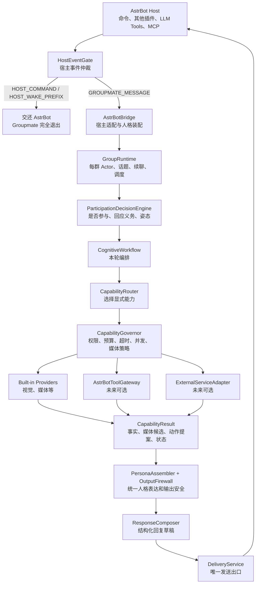

# Groupmate 宿主命令与内部能力扩展边界设计

日期：2026-07-31

状态：Host Command Isolation 与 Capability Governance 已实施；Provider SPI 待实施

适用范围：AstrBot 宿主共存、Groupmate 内部能力扩展、Phase 6 后续架构

## 1. 设计目的

Groupmate 本身以 AstrBot 插件形式运行，因此它不是群消息的唯一处理者。同一个
AstrBot 实例中还可能存在群管理、娱乐、查询和自动化插件，例如使用 `/取名`
命令的群管理插件。

本设计同时解决两个问题：

1. AstrBot 及其他 AstrBot 插件拥有的命令不能被 Groupmate 抢答、污染或阻断；
2. Groupmate 未来需要扩展搜索、视觉、媒体、日历或外部服务等综合能力，但这些
   扩展不能绕过 Groupmate 的参与决策、人格、安全策略和唯一发送路径。

本文覆盖并替代旧 V3 路线中与宿主命令旁路、Phase 6 能力注册和外部能力接入冲突
的描述。每群 Actor、显式人格上下文、统一参与决策、SQLite 人格隔离和唯一
DeliveryService 等已经落地的边界继续有效。

本阶段只冻结架构，不实现动态插件加载、MCP 能力市场或新的外部能力。

## 2. 两种插件必须分层

### 2.1 AstrBot Plugin（宿主插件）

AstrBot Plugin 由 AstrBot 注册、排序和调用。它可以拥有：

- `@filter.command` 命令；
- 平台事件处理器；
- AstrBot Function Calling 工具；
- AstrBot 生命周期和配置；
- `stop_event()` 等宿主事件控制能力。

Groupmate、群管理插件和其他第三方插件在这一层是平级关系。Groupmate 不拥有其他
插件，也不能把其他插件的命令当成自己的内部能力。

### 2.2 Groupmate Capability Provider（内部能力提供器）

Capability Provider 只属于 Groupmate 内部运行时。它不向 AstrBot 注册独立插件，
也不直接接收 AstrBot Event。它只接收受控的类型化请求并返回类型化结果。

内部能力可以实现：

- 图片理解；
- 外部事实查询；
- 媒体候选检索；
- 日历或提醒信息读取；
- 经过治理的动作提案；
- 对 AstrBot Function Calling 或外部服务的适配。

“宿主插件”和“内部能力提供器”虽然都能扩展功能，但生命周期、权限和数据边界
完全不同。代码和文档中不得用同一个 `Plugin` 抽象兼容二者。

## 3. 总体架构



这套架构有两个连续的治理点：

1. `HostEventGate` 决定这条 AstrBot 事件是否属于 Groupmate；
2. `CapabilityGovernor` 决定 Groupmate 已经接管的会话是否允许调用某个内部能力。

前者保护 AstrBot 插件生态，后者保护 Groupmate 核心。

## 4. HostEventGate（宿主事件闸门）

### 4.1 位置

`HostEventGate` 必须位于 `main.py` 通用群消息处理器和 `AstrBotBridge` 之间，并且在
创建 GroupActor、翻译为正式 `ChatMessage`、写入话题窗口或持久化消息之前执行。

它是宿主适配层的一部分，不进入 `engine/`、`persona/`、`memory/` 或
`capabilities/`。

### 4.2 分类结果

```text
HostEventDisposition
├── HOST_COMMAND
├── HOST_WAKE_PREFIX
├── GROUPMATE_MESSAGE
└── IGNORE
```

- `HOST_COMMAND`：AstrBot 已经匹配一个命令处理器，包括其他插件命令和 Groupmate
  自己的管理命令；
- `HOST_WAKE_PREFIX`：消息使用 AstrBot 当前配置的唤醒前缀，但没有可靠证据证明
  它属于 Groupmate；
- `GROUPMATE_MESSAGE`：普通群消息、真实平台 `@`、回复机器人或 Groupmate 人格称呼；
- `IGNORE`：无群 ID、自身回环、宿主已终止或不在启用范围内的事件。

### 4.3 已注册命令

AstrBot 在执行插件处理器之前统一评估过滤器，并把匹配结果写入
`activated_handlers`。`HostEventGate` 可以据此识别已经注册的命令，但宿主反射逻辑
必须只存在于一个 AstrBot 适配器中，不能散落到领域代码。

例如：

```text
/取名 小明
  -> AstrBot 激活群管理插件命令处理器
  -> HostEventGate = HOST_COMMAND
  -> Groupmate 通用监听器立即返回
  -> 群管理插件继续执行
```

该路径与插件优先级无关，因为命令匹配发生在处理器执行之前。

### 4.4 未知、禁用和改名前缀命令

仅依赖 `activated_handlers` 不足以保护以下消息：

- 尚未注册的 `/未知命令`；
- 已禁用插件原先拥有的命令；
- AstrBot 管理员把唤醒前缀从 `/` 改为 `!` 后的 `!取名`；
- 命令重命名期间暂时没有处理器匹配的输入。

因此闸门必须读取 AstrBot 当前配置的 wake prefixes，并保留或恢复原始消息文本。
所有“使用宿主唤醒前缀、但未被明确识别为 Groupmate 原生呼叫”的输入都归类为
`HOST_WAKE_PREFIX`。不能硬编码 `/`。

如果底层 AstrBot 版本在插件处理前已经剥离前缀，宿主适配器必须从原始事件或原始
消息链提取这一事实。提取失败时采用保守策略：宿主唤醒事件不进入 Groupmate
普通候选参与路径。

### 4.5 传播规则

Groupmate 通用群消息监听器必须遵守：

- 不调用 `event.stop_event()`；
- 不修改其他插件的 `activated_handlers`；
- 不消费或改写其他插件的命令参数；
- 对宿主命令不调用 `event.should_call_llm(True)`；
- 对宿主命令不生成 Groupmate 回复；
- 允许其他 AstrBot 插件按照宿主规则继续执行。

若另一个插件主动调用 `stop_event()`，Groupmate 可能看不到该事件。对命令事件而言
这是可接受结果，Groupmate 不要求观察所有宿主命令。

### 4.6 状态隔离

`HOST_COMMAND` 和 `HOST_WAKE_PREFIX` 必须在进入 Groupmate 之前终止，因此不得：

- 创建或唤醒 GroupActor；
- 追加 TopicWindow；
- 打开、关闭或延长 topic epoch；
- 新建 continuation；
- 更新重复呼叫压力、社会事件或关系状态；
- 写入 Groupmate 消息、决策、记忆候选或 outbox；
- 调用模型、视觉能力或其他 Capability Provider；
- 触发 DeliveryService。

这比“进入 runtime 后判断 `TriggerKind.COMMAND` 再沉默”更强。后者虽然通常不发言，
仍会污染 Groupmate 的内部状态。

## 5. Groupmate 自有命令

Groupmate 当前管理命令继续由 AstrBot 显式注册：

- `/groupmate_status`；
- `/groupmate_pause`；
- `/groupmate_resume`；
- `/groupmate_reset`。

规则如下：

1. 自有命令也属于 `HOST_COMMAND`，不得重新进入通用群消息链路；
2. 命令名使用 `groupmate_` 前缀或未来统一的 `/groupmate ...` 命令组；
3. Capability Provider 默认禁止自行注册 AstrBot 命令；
4. 新增宿主命令必须在 Groupmate 顶层插件中显式评审和注册；
5. 命令响应是宿主控制面输出，不经过人格生成，也不写入人格对话记忆。

这样可以避免内部能力包逐渐演变成多个互相抢命令的 AstrBot 子插件。

## 6. Capability Provider SPI（内部能力扩展接口）

### 6.1 核心契约

第一阶段采用静态、显式注册，不扫描目录，不动态导入未知代码。

```text
CapabilityManifest
  name
  version
  supported_intents
  permission_profile
  latency_class
  cost_class
  failure_policy
  max_result_size

CapabilityProvider
  start()
  health()
  execute(request, context) -> CapabilityResult
  close()

CapabilityContext
  persona_id
  group_id
  actor_id
  message_id
  trace_id
  deadline
  allowed_permissions
  media_policy

CapabilityResult
  status
  facts
  media_candidates
  action_proposals
  error_code
  diagnostic
```

现有 `CapabilityRequest`、`CapabilityResult`、`MediaCandidate`、`CapabilitySpec`、
`CapabilityManifest`、`CapabilityContext`、`CapabilityRegistry` 和 `CapabilityGovernor`
已经形成静态能力治理基础。Provider SPI 后续仍需补齐生命周期、发现、健康检查和
统一装配规范；实施时应继续演进现有契约，而不是建立第二套并行能力系统。

### 6.2 Provider 权限限制

Capability Provider 默认不能持有：

- AstrBot 原始 `Context` 或 `AstrMessageEvent`；
- `PlatformPort` 或 `DeliveryService`；
- `MemoryRepository` 写接口；
- `PersonaRegistry` 修改接口；
- `GroupActor`、TopicWindow 或 continuation 修改接口；
- AstrBot 命令注册器；
- `stop_event()` 或 `should_call_llm()` 控制能力。

Provider 只能使用 Manifest 声明且 Governor 授权的窄接口。读取能力和副作用能力必须
分开授权。

### 6.3 返回结果，而不是最终回复

Provider 只能返回事实、媒体候选、状态或动作提案，不能返回一条绕过人格层直接发送
的最终群消息。

```text
用户消息
  -> Provider 返回“上海明天 31°C，有阵雨”
  -> PersonaAssembler 决定爱弥斯如何表达
  -> OutputFirewall 检查
  -> ResponseComposer 组装文本/媒体
  -> DeliveryService 发送
```

这样外部能力不会带入另一套人格，也不会形成第二个发送出口。

### 6.4 动作能力

未来若增加群管理、提醒创建等带副作用的能力，Provider 不得直接执行。它先返回
`ActionProposal`，其中至少包含动作类型、目标、参数摘要、权限要求、幂等键和过期
时间。CapabilityGovernor 与宿主动作适配器完成授权和执行。

读取事实和执行动作不得共用一个默认权限级别。首个 Capability SPI 实施阶段可以只
支持只读事实和媒体结果，动作提案留在契约中但不开放执行器。

## 7. CapabilityRouter 与 CapabilityGovernor

### 7.1 CapabilityRouter

Router 根据已经形成的 `ParticipationDecision`、`ResponseAct` 和明确任务需求选择能力。
Provider 无权监听所有群消息并自行决定何时启动。

每一轮默认最多选择一个主能力；只有规格明确允许时才能组合多个能力。路由失败必须
返回明确的 `UNSUPPORTED` 或 `CLARIFY`，不能让生成模型伪造能力结果。

### 7.2 CapabilityGovernor

Governor 是所有 Provider 的统一执行入口，负责：

- Provider 是否注册且健康；
- persona/group 是否允许该能力；
- 权限范围；
- 调用 deadline 和 timeout；
- 并发与取消；
- 成本和频率预算；
- `MediaPolicy` 是否允许媒体结果；
- 结果大小和结构验证；
- 错误码、trace 和失败降级。

当前仅对 vision 特判预算的逻辑应在后续实施中迁入 Governor。Composer 只能接收已经
通过 Governor 与媒体策略校验的候选。

## 8. AstrBot 工具与其他插件能力的复用

Groupmate 不通过伪造 `/取名` 等聊天命令调用其他插件。Slash command 是面向用户的
宿主交互协议，不是稳定的程序间接口。

需要复用 AstrBot Function Calling、MCP 或另一个插件提供的服务时，采用显式适配：

```text
CapabilityProvider
  -> AstrBotToolGatewayPort
  -> AstrBot 已注册 Tool / MCP / Service API
  -> 结构化 CapabilityResult
```

`AstrBotToolGateway` 仍受 CapabilityGovernor 约束，并且只能返回结构化结果。它不能
让 AstrBot Agent 和 Groupmate 在同一轮同时形成最终回复。

若另一个 AstrBot 插件只暴露 slash command 而没有工具或服务 API，Groupmate 不复用
该能力，也不发送模拟命令。需要双方明确约定一个程序接口后才能集成。

## 9. 单一归属与单一发送

每个宿主事件只能有一个最终回复所有者：

```text
HOST_COMMAND      -> 对应 AstrBot 插件
HOST_WAKE_PREFIX  -> AstrBot 宿主/Agent
GROUPMATE_MESSAGE -> Groupmate 或沉默
```

Groupmate 已接管的事件继续遵守：

- 参与决策决定说或不说；
- Capability 只提供材料；
- Persona 负责表达；
- OutputFirewall 负责输出约束；
- ResponseComposer 负责结构；
- DeliveryService 是文本和媒体的唯一发送入口。

同一轮不得同时由 AstrBot Agent 和 Groupmate 回复。发生能力 handoff 时，归属必须在
调用外部 Agent 前明确转移，并记录 trace。

## 10. 错误处理与降级

- 宿主命令识别失败：保守归宿主，不进入 Groupmate；
- Provider 未注册或不可用：返回 `UNSUPPORTED`，不伪造结果；
- Provider 超时：取消调用并按任务类型澄清、文字降级或沉默；
- Provider 返回非法结构：丢弃结果并记录 `invalid_result`；
- 媒体不符合策略：移除媒体，保留安全文字结果；
- 外部工具报错：诊断只写 trace，不泄漏到人格回复；
- Delivery 失败：继续使用现有 outbox 状态机，不由 Provider 重试发送。

任何能力失败都不能阻塞后续群消息进入每群 Actor。

## 11. 测试契约

### 11.1 AstrBot 多插件共存

后续实施必须使用伪造的第二个 AstrBot 插件覆盖：

- `/取名` 已注册且匹配时，Groupmate 不回复、不写状态；
- 命令插件优先级高于、等于和低于 Groupmate 时结果一致；
- 命令插件调用 `stop_event()` 时 Groupmate 不要求观察；
- 命令插件不调用 `stop_event()` 时 Groupmate 仍不进入内部链路；
- AstrBot 前缀为 `/`、`!` 和多前缀配置时均正确避让；
- 未知、禁用和重命名后的前缀输入不被 Groupmate 当作普通聊天；
- `@Bot /取名`、回复 Bot 后跟命令等组合输入不被误接管；
- `/groupmate_*` 只执行显式管理命令，不进入普通观察链路；
- 普通消息、真实 `@Bot` 和人格句首称呼仍能进入原有 Groupmate 流程。

对命令路径至少断言以下副作用为零：

- Actor 创建；
- TopicWindow 追加；
- message/decision/memory/outbox 写入；
- Provider 调用；
- `should_call_llm(True)`；
- Delivery 调用。

### 11.2 Capability SPI

后续能力层测试至少覆盖：

- 只能执行显式注册的 Provider；
- 重名 Manifest 拒绝启动；
- Provider 不能获得平台发送和记忆写接口；
- deadline、取消、预算和并发上限生效；
- 非 SUCCESS 结果不能夹带已完成事实或媒体；
- MediaPolicy 禁止时 Composer 不接收能力媒体；
- 外部结果必须经过 Persona 和 OutputFirewall；
- Provider 失败不能产生第二发送出口；
- AstrBot Tool handoff 与 Groupmate 最终回复互斥。

## 12. 代码责任边界

目标目录责任如下：

```text
main.py
  AstrBot 插件注册、显式管理命令、通用事件入口

groupmate/host/
  HostEventGate、AstrBot 事件事实提取、Bridge、Tool Gateway、平台适配

groupmate/engine/
  每群 Actor、参与决策、工作流、Composer、Delivery

groupmate/capabilities/
  Manifest、Provider SPI、Registry、Router、Governor、内置 Provider

groupmate/persona/
  人格注册、上下文编译、表达和 OutputFirewall

groupmate/memory/
  人格隔离 SQLite 状态、outbox、记忆和关系投影
```

依赖方向：

```text
main -> host -> engine -> capabilities contracts
                    -> persona contracts
                    -> memory contracts

capabilities -X-> host
capabilities -X-> delivery/platform
persona      -X-> AstrBot
memory       -X-> AstrBot
```

`-X->` 表示禁止依赖。

## 13. 分阶段实施建议

本文获批准后另写实施计划，建议拆为三个独立阶段：

1. **Host Command Isolation**：前移 HostEventGate，保证 AstrBot 命令零副作用；
2. **Capability Governance**：在现有 Registry 上增加 Manifest、Context、Governor 和
   MediaPolicy 执行；
3. **Provider SPI**：把 vision 和 external handoff 迁入统一 Provider 生命周期，并
   建立未来 Tool Gateway 接口。

三个阶段必须分别可测试、可提交、可回滚。第一阶段不依赖后两个阶段，应优先完成。

## 14. 架构验收标准

只有同时满足以下条件，才能认为该边界已经落地：

1. 其他 AstrBot 插件命令不会触发 Groupmate 回复或内部状态变化；
2. 未知前缀输入采用宿主优先策略；
3. Groupmate 不阻止 AstrBot 后续插件处理；
4. 内部能力不能注册宿主命令或直接发送消息；
5. 新能力无需修改 TriggerRouter 和 DeliveryService 主逻辑；
6. 所有能力结果经过 Governor、Persona、Guard、Composer 和 Delivery；
7. AstrBot Agent、其他插件和 Groupmate 的最终回复归属互斥；
8. 当前每群 Actor、人格隔离、参与决策与 outbox 语义不回退。

## 15. 当前架构评价

当前 Groupmate 的核心分层总体合理：宿主适配、每群 Actor、参与决策、人格、记忆和
Delivery 已经有明确边界；现有 Capability contracts/registry/governor 也提供了
静态治理基础。

当前不足主要集中在 Provider SPI：能力注册仍是 Bridge 中的静态装配，尚未提供动态
发现、生命周期、健康检查或统一外部服务适配。因此当前系统适合继续演进，但还不能
称为完整的内部插件平台。

Host Command Isolation 与 Capability Governance 落地后，外部能力扩展不需要改写人格、参与决策或发送链路，AstrBot
其他插件也能保持独立。这比引入动态扫描或通用插件框架更符合当前规模，并为后续
AstrBot Tool、MCP 或外部服务适配保留了清晰接口。

## 16. 官方参考

- AstrBot 消息事件与 `stop_event()`：<https://docs.astrbot.app/dev/star/guides/listen-message-event.html>
- AstrBot 内置与插件命令：<https://docs.astrbot.app/use/command.html>
- AstrBot Function Calling：<https://docs.astrbot.app/en/use/function-calling.html>
- AstrBot WakingCheckStage：<https://github.com/AstrBotDevs/AstrBot/blob/master/astrbot/core/pipeline/waking_check/stage.py>
- AstrBot ProcessStage：<https://github.com/AstrBotDevs/AstrBot/blob/master/astrbot/core/pipeline/process_stage/stage.py>
