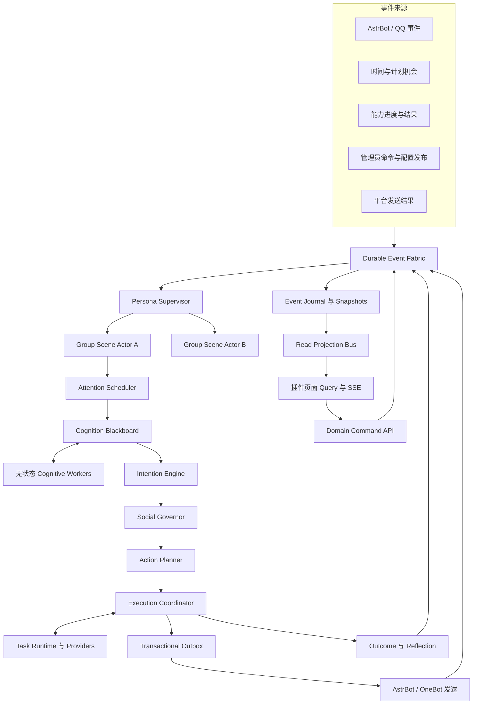

# Groupmate Social Runtime v2 中文设计规格

**状态：** 2026-08-18 分段评审确认；随后确认采用 clean-slate 实施，不兼容旧插件内部架构与数据
**权威性：** 本文档取代 `2026-08-18-groupmate-target-bot-full-redesign.md` 中以 Turn 为中心的设计
**范围：** 运行时架构、社会认知、人格连续性、记忆与学习、行动与能力、交付、控制面、插件页面、迁移、测试和上线

## 1. 目标

围绕一个持续存在的社会智能体运行时重建 Groupmate，使其能够实现已分析目标 QQ 群聊伙伴的行为效果，并在上下文判断、长期连续性、工具可靠性、隐私和运维控制方面超过目标 bot。

目标效果来自以下机制共同作用，而不是来自口癖模仿：

- 持续理解群聊，而不是逐条处理孤立的请求/响应 Turn；
- 在开放群聊中进行有依据、符合时机的参与；
- 稳定但具有因果状态的人格身份；
- 持久的成员关系、共同经历和群文化；
- 有边界的自主发起能力；
- 自然的短文本节奏和媒体使用；
- 由同一人格拥有的工具进度与最终结果；
- 可解释、可审计、可纠正的状态和学习；
- 由确定性代码掌握隐私、工具、状态修改和发送权限。

新架构必须允许模型提供更强智能，但不能让不受约束的模型输出成为系统权威。

## 2. 已确认的产品边界

### 2.1 有边界的自主性

即使没有新消息，机器人也可以根据具体来源主动发起，例如未完事项、成员事件、群内仪式、计划状态变化、延迟机会或自身承诺。

每个自主机会必须具备：

- 证据或持久目标；
- 明确的群和预期对象；
- 最早执行时间和过期时间；
- 最大尝试次数；
- 执行前根据最新群场景重新验证；
- 安静时段、边界、隐私和预算检查。

自主性不得用于编造事实、刷存在感、无依据递归创建跟进，或在缺少确认时执行高风险外部操作。

### 2.2 共享自我，隔离关系

跨群共享：

- Persona Constitution（人格宪法）；
- Self Model（自我模型）；
- 全局睡眠、能量、心境和工作负载；
- 能力可用性与全局资源预算；
- 自身承诺和管理员发布的长期偏好。

默认按群隔离：

- 成员身份和关系状态；
- 成员事实与社交印象；
- 共同经历；
- 群文化与内部梗；
- 原始消息；
- 主动关心依据。

跨群成员连续性必须先由管理员建立身份关联，并明确允许传递的数据类型。敏感经历和群内关系永远不会自动跨群传播。

### 2.3 分层可塑性

- 人格身份、价值观、稳定边界、隐私和安全策略不能自动修改；
- 关系、称呼、记忆、社交印象、群文化和未完事项可以根据受治理证据学习；
- 注意窗口、回复长度倾向、媒体偏好和参与权重可以在管理员设定范围内、经过足够复核样本后校准；
- 模型不能重写提示词、代码、策略、工具权限或安全上限。

## 3. 被否决的架构

### 3.1 仅通过提示词模仿

提示词风格无法产生场景意识、自主时机、持久状态、任务连续性、媒体可靠性和治理能力，因此不采用。

### 3.2 增强旧 Turn Workflow

即使增加心情和更多参与动机，“一条消息产生一个 `SPEAK/SILENCE/TASK` 结果”仍然是请求/响应机器人。群聊意义经常由连续消息和多个并行话题共同形成，因此不能继续作为核心。

### 3.3 全多智能体社会

长期独立运行的多个 Agent 会造成延迟、成本、状态竞争和人格分裂，因此不作为默认核心。允许使用专业认知 Worker，但它们必须无状态，只能提出建议，并受单一 Social Runtime 管理。

## 4. 架构原则

1. 群聊是持续事件流，不是聊天请求队列。
2. 每个人格只有一个 `PersonaSupervisor` 管理共享自我。
3. 每个人格/群只有一个 `GroupSceneActor` 管理该群的社会世界。
4. 模型可以观察、解释、提议、总结和起草，但不能授权或提交。
5. 参与判断同时考虑社会价值、打断成本、不确定性、对象归属、关系、状态和风险。
6. 沉默、观察、延迟、休息、任务开始、失败和过期都是正式结果。
7. 一次行动可以包含文本、媒体、工具、进度和跟进，但只有一个最终回复所有者。
8. 长任务异步执行，并以事件重新进入 Actor。
9. 每个可见动作都有因果事件链和幂等发送记录。
10. 群内保持人格沉浸，管理页面保持真实、透明和可回滚。
11. 页面和 Projection 故障不能影响权威群聊写线路。
12. 旧 Groupmate 代码只是适配和迁移来源，不能约束新的社会模型。
13. 旧运行时、旧状态、旧配置和旧页面不构成兼容要求；凡是不符合本文领域边界的实现与测试都从新分支删除。

## 5. 系统总体拓扑



唯一可以授权群内可见动作的线路是：

```text
持久事件
→ 群场景
→ 注意力
→ 认知
→ 候选意图
→ Social Governor
→ 已验证 ActionPlan
→ 已提交 Outbox
→ 平台发送
```

## 6. Durable Event Fabric

### 6.1 事件信封

所有刺激统一使用：

```python
@dataclass(frozen=True)
class SocialEventEnvelope:
    event_id: str
    event_type: str
    occurred_at: int
    received_at: int
    persona_id: str
    group_id: str | None
    actor_id: str | None
    source_message_id: str | None
    correlation_id: str
    causation_id: str | None
    payload: Mapping[str, object]
```

事件家族包括：

- 平台消息、回复、@、戳一戳、反应和媒体；
- 定时、唤醒、睡眠、恢复、承诺、跟进和延迟机会；
- 能力接受、进度、成功、失败、取消和过期；
- 配置发布、纠正、暂停、重置、复核和回滚；
- 发送成功、失败、未知、过期和抑制；
- 记忆整合与行为校准。

### 6.2 持久性和幂等

- 事件进入 Actor 前先写入 Durable Inbox；
- 优先使用平台稳定 ID 去重，缺失时使用有界指纹；
- 每个处理器以 `event_id` 保证幂等；
- `correlation_id` 连接一次完整社交交互或任务；
- `causation_id` 保存可回放的因果链；
- Actor 只有在影响提交后才推进 Inbox Cursor；
- 原文保留策略与结构化事件保留策略相互独立。

### 6.3 事件回放

回放用于：

- Actor 恢复；
- 使用固定 Worker 输出进行确定性测试；
- Shadow 对比；
- 重建 Projection；
- 调查关系、状态、记忆、任务和发送变化。

除非恢复状态能够证明原平台调用未提交，否则回放禁止重新发送历史 Outbox 内容。

## 7. Actor 层级

### 7.1 Persona Supervisor

每个人格只有一个 Supervisor，并独占写入：

- 当前 Constitution 与 Self Model 版本；
- 全局在场、能量、心境、烦躁和认知负载；
- 跨群共享的模式状态；
- 全局能力和生成预算；
- 自身承诺；
- 群 Actor 注册表和生命周期。

不同群可以并发运行。群 Actor 请求不可变 `PersonaSnapshot`，并提交有边界的 `GlobalStateEffect`。Supervisor 负责证据验证、限幅、去重、应用、版本化和发布。

### 7.2 Group Scene Actor

每个 `(persona_id, group_id)` 只有一个 Actor，并独占写入：

- 活跃话题和话题转换；
- 参与者和互动关系图；
- 机器人在不同话题中的角色；
- 群活跃度和社交氛围；
- 待评估社交机会；
- 群内在场节奏；
- 正在运行的任务引用；
- 通过领域服务管理的群关系、印象、文化、记忆和未完事项。

Actor 每次只执行一个状态修改，但不会阻塞等待模型、能力、页面查询或平台发送。外部工作异步派发，结果作为带版本事件返回。

### 7.3 Clean-slate 代码边界

V2 不承担旧架构兼容义务。当前 `engine`、`core`、`social`、`memory`、Host Bridge、配置和页面实现都可以删除，并由本规格定义的接口重新实现。

只有满足以下条件的低层代码才允许重新采用：

- 不导入旧 Workflow、Participation、Persona Context、社会状态或 Store 类型；
- 能通过独立 Contract Test 证明输入、输出、错误和副作用边界；
- 不要求 V2 适配旧生命周期、旧配置形状或旧页面 Snapshot；
- 复用成本明显低于按新接口重写。

典型候选仅包括 AstrBot/OneBot 原始事件访问方式、平台发送调用方式、Provider 发现方式和 SQLite 连接参数。即使复用，也应复制到新 Adapter 边界并改用 V2 类型，而不是让新核心反向依赖旧模块。

新核心代码放在 `groupmate/social_runtime/`。Git 历史负责找回旧实现，不在新运行时保留兼容 Facade。

## 8. 群世界模型

```python
@dataclass(frozen=True)
class GroupWorldState:
    group_id: str
    scene_version: int
    active_topics: tuple[TopicState, ...]
    participants: tuple[ParticipantState, ...]
    interaction_edges: tuple[InteractionEdge, ...]
    group_activity: GroupActivity
    social_atmosphere: SocialAtmosphere
    bot_roles: tuple[BotTopicRole, ...]
    pending_opportunities: tuple[OpportunityRef, ...]
    running_tasks: tuple[TaskRef, ...]
    open_loops: tuple[OpenLoopRef, ...]
    recent_presence: PresenceHistory
    culture_version: int
```

群世界可以同时存在多个话题。消息是否最新不能单独决定其对象和话题。

World Projector 按以下优先级工作：平台事实、确定性关系/连续性规则、带置信度的模型观察。模型假设不能覆盖明确的回复链和 @。

## 9. 注意力系统

### 9.1 快速注意 Fast Attention

以下事件立即创建 Attention Frame：

- 直接 @、回复或称呼；
- 戳一戳或明确互动；
- 任务请求或确认；
- 边界和安全事件；
- 能力结果；
- 管理员紧急操作。

简单场景使用最小认知成本，但仍必须读取最新场景和权威策略。

### 9.2 环境注意 Ambient Attention

环境注意收集动态消息窗口，使机器人能够等待成员说完、理解并行话题并避免回复中间句。

窗口长度取决于：

- 群消息速度；
- 标点和续写信号；
- 回复所有权；
- 话题是否完整；
- 机器人近期在场情况；
- 是否出现更高优先级事件。

默认档位可在安静群使用约 1–2 秒、普通群 2–4 秒、高速群 3–6 秒。它是有边界的场景等待，不是模拟思考。

### 9.3 时间注意 Temporal Attention

时间注意处理：

- 承诺和已接受任务；
- 有证据的自然跟进；
- 延迟环境机会；
- 睡眠、醒来、恢复和换日；
- 群内仪式和机器人自己留下的开放事项。

时间事件只能提出注意机会，不能授权发送。

### 9.4 Attention Frame

```python
@dataclass(frozen=True)
class AttentionFrame:
    frame_id: str
    group_id: str
    scene_version: int
    trigger_kind: str
    focus_topic_ids: tuple[str, ...]
    focus_event_ids: tuple[str, ...]
    candidate_audiences: tuple[str, ...]
    urgency: str
    deadline: int
    requested_workers: tuple[str, ...]
```

引用过期场景的 Worker 结果必须按触发类型丢弃、重新验证或重新请求。过期的环境解释不能直接产生发送。

## 10. Cognitive Workers 与 Cognition Blackboard

### 10.1 认知成本等级

- Level 0：规则处理去重、硬对象归属、硬安全和资源阻断；
- Level 1：单模型处理普通直接聊天和明确任务；
- Level 2：多 Worker 处理多话题、玩笑、关心、连续性和模糊参与；
- Level 3：对敏感、高风险、高价值或强冲突机会进行反事实审议。

### 10.2 Worker 角色

- 场景解释；
- 对话对象解析；
- 社交信号解释；
- 任务理解；
- 连续性匹配；
- 群文化解释；
- 参与机会批评；
- 风险评估；
- 反事实批评；
- 回应草案；
- 记忆与反思候选提取。

Worker 只能返回：

```python
@dataclass(frozen=True)
class CognitiveObservation:
    worker: str
    kind: str
    proposition: Mapping[str, object]
    confidence: float
    evidence_event_ids: tuple[str, ...]
    scene_version: int
    expires_at: int
    uncertainty: tuple[str, ...]
```

Worker 无权修改状态、发送、执行工具、写入记忆、修改策略或发布配置。

### 10.3 Cognition Blackboard

黑板只存在于一次认知周期，支持：

- 多个相互冲突的假设；
- 证据聚合；
- 事实高于解释；
- 观察过期；
- 场景版本检查；
- 不确定性传播；
- 向意图生成提供有边界上下文。

黑板不是长期记忆，周期提交后即销毁。

## 11. 人格目标与候选意图

稳定目标包括：

- 保持身份和价值观一致；
- 建立双向、有边界的关系；
- 在有价值时提供帮助；
- 完成已接受任务和承诺；
- 表达真实偏好；
- 参与群文化但不垄断；
- 保护边界和隐私；
- 保存精力并休息；
- 不确定时观察。

Intention Engine 可以提出：

- 应声、回答、帮助、关心、玩笑、连接语境、表达偏好；
- 延续话题、跟进、欢迎、媒体反应；
- 维护边界、接受任务、报告进度、交付结果；
- 主动发起、观察或休息。

```python
@dataclass(frozen=True)
class CandidateIntention:
    intention_id: str
    kind: str
    target_id: str | None
    topic_id: str | None
    evidence_event_ids: tuple[str, ...]
    proposed_act: str
    obligation: float
    relevance: float
    relational_value: float
    continuity_value: float
    novelty: float
    urgency: float
    persona_fit: float
    state_fit: float
    information_gain: float
    disruption_cost: float
    uncertainty_cost: float
    repetition_cost: float
    resource_cost: float
    risk: float
    expires_at: int
```

## 12. Social Governor

Social Governor 是确定性、代码所有的决策核心。

### 12.1 硬约束

- 对象和话题所有权；
- 隐私和敏感性；
- 明确边界和拒绝；
- 群/人格暂停；
- 事件、场景和机会过期；
- 能力权限和确认；
- 幂等和已有任务所有权；
- 平台可用性。

硬约束不能被模型置信度或效用分数覆盖。

### 12.2 义务

Governor 识别直接回应、已接受任务报告、承诺、边界和管理员通知义务。必要结果可以使用确定性 Fallback，但义务不意味着可以无限生成或执行工具。

### 12.3 社会效用

通过硬门控的候选按版本化行为档案排序：

```text
社会效用 =
  义务
  + 相关度
  + 关系价值
  + 连续性价值
  + 新颖性
  + 人格契合
  + 状态契合
  + 信息价值
  - 打断成本
  - 不确定成本
  - 重复成本
  - 资源成本
  - 风险成本
```

效用只用于选择和排序，不转换成随机回复概率。

### 12.4 冲突、组合和节奏

- 兼容的关心与帮助可以组合；
- 轻媒体可以与一条短社交动作组合；
- 边界意图抑制亲密和玩笑；
- 任务结果取代尚未发送的进度；
- 不同对象通常需要不同机会；
- 机器人近期发言、人类轮次、话题转换、群速度、对象集中、媒体密度和重复情况共同影响打断成本。

### 12.5 Governor Result

```python
@dataclass(frozen=True)
class GovernorResult:
    outcome: str  # ACT, DEFER, OBSERVE, SILENCE
    selected_intention_ids: tuple[str, ...]
    rejected: tuple[RejectedIntention, ...]
    reason_codes: tuple[str, ...]
    reconsider_at: int | None
    constraints: tuple[str, ...]
```

## 13. Persona Kernel

### 13.1 Constitution

只有管理员发布才可修改：

- 身份和价值观；
- 稳定边界；
- 稳定偏好；
- 表达不变量；
- 安全不变量；
- 允许的模式和自主原则。

### 13.2 Self Model

由真实事件支持并可更新：

- 承诺和任务历史；
- 能力可用性和可靠性；
- 稳定且非敏感的偏好；
- 跨群重复承担的角色；
- 经复核的重复失败模式。

### 13.3 全局自身状态

```python
@dataclass(frozen=True)
class GlobalSelfState:
    presence: str
    energy: int
    valence: int
    arousal: int
    irritation: int
    cognitive_load: int
    recovery_state: str
    last_transition_at: int
    next_transition_at: int | None
    version: int
```

原始数值不会出现在群回复中。状态影响注意力、意图显著性、长度、模态、自主性、并发和边界。

### 13.4 Mode Director

模式由一个主模式和有限修饰状态组合：

```python
@dataclass(frozen=True)
class PersonaModeState:
    primary: str  # social, focused_task, quiet_observer, boundary
    modifiers: tuple[str, ...]  # playful, warm, drowsy, irritated
    activated_by: tuple[str, ...]
    expires_at: int | None
```

模式转换必须来自事件、时间、工作负载或管理员命令，禁止每轮随机切换。

### 13.5 状态影响

模型可以提出带证据的状态影响。代码所有的转换策略负责验证、限幅、冷却、衰减、因果去重和版本化。

成员没有回复不是负面证据，单个表情不能形成长期心情或关系变化。

## 14. 关系、印象、群文化与记忆

### 14.1 关系状态

关系是证据事件的多维 Projection，包含熟悉、温度、信任、互惠、玩闹接受度、可靠性、关心许可和边界压力。

关系永远不能授予平台或工具权限。

### 14.2 社交印象

印象是带置信度、按群隔离的理解，例如称呼偏好、兴趣、互动方式、玩笑接受度、作息、敏感话题、群内角色和固定相处模式。

每条印象保存证据、状态、过期时间，并分别控制能否影响称呼、语气、参与、关心或建议。

### 14.3 群文化

群文化包括重复出现的梗、局部简称、仪式、角色关系、常见话题、玩笑边界、群节奏和群成员对机器人的期待。

单次出现通常只属于情景记忆。成为正式群文化需要重复出现或管理员确认。群文化会衰减，且默认不能跨群。

### 14.4 记忆分层

- 工作记忆：一次认知周期和活跃场景；
- 情景记忆：带时间的互动和共同事件；
- 语义记忆：带来源和有效期的稳定事实；
- 关系记忆：证据事件与关系 Projection；
- 程序性社交记忆：群级互动偏好；
- 自身记忆：任务、承诺、成功、失败和经复核偏好。

### 14.5 写入流水线

```text
真实事件
→ 候选提取
→ 实体解析
→ 隐私与作用域
→ 冲突检查
→ 重要性与持久性
→ 权威判定
→ 接受、进入待复核或拒绝
```

生成回复不能证明用户事实。摘要必须保留证据引用。冲突信息需要版本化或待确认，不能盲目覆盖。敏感事实默认不自动保存。删除会创建墓碑，阻止等价内容自动重新学习。

### 14.6 召回

召回由意图和对象驱动：

```text
意图与对象
→ 允许的作用域
→ 记忆类型
→ 相关度、时效、置信度和多样性
→ 敏感过滤
→ 冲突标记
→ Token 预算
→ 结构化 Context Block
```

生成器不能获得不受限制的数据库记录集合。

### 14.7 学习与整合

在线学习更新事件支持的短期状态和候选内容。周期性 Consolidation 负责合并重复情景、检测冲突、衰减印象、提升重复群文化、关闭已完成事项并将异常送入复核。

行为校准只能调整管理员允许的群级参数，必须满足最小样本量并经过 Shadow 对比。每次变化都要版本化、审计和可回滚。安全、隐私、权限和 Constitution 权重不能自动校准。

## 15. Action Planning 与 StyleDirector

### 15.1 ActionPlan DAG

```python
@dataclass(frozen=True)
class ActionPlan:
    plan_id: str
    correlation_id: str
    group_id: str
    persona_id: str
    scene_version: int
    intention_ids: tuple[str, ...]
    audience: tuple[str, ...]
    topic_id: str | None
    origin: str
    nodes: tuple[ActionNode, ...]
    edges: tuple[ActionEdge, ...]
    constraints: tuple[str, ...]
    expires_at: int
```

节点包括生成文本、选择反应、选择媒体、调用能力、请求确认、等待任务事件、渲染进度、渲染结果、发送 Bundle、记录观察和安排跟进。

计划必须是有限 DAG，并限制节点数、持续时间、重试和自主跟进次数。

### 15.2 Plan Validator

验证内容包括当前场景、对象、Constitution、关系和状态、权限、风险、媒体引用、预算、并发、节点所有权、有限终止和可见输出所有权。

无效计划只能被缩减、重新规划、延迟、澄清或放弃。模型不能绕过验证。

### 15.3 StyleDirector

文本生成前，StyleDirector 输出结构化风格指令，包括模式、回应行为、关系姿态、称呼、长度、句子/段数、温度、玩闹程度、直接程度、语气词和标点预算、媒体搭配和近期禁用模式。

生成后依次经过：

1. 通用安全护栏；
2. 事实/能力结果一致性护栏；
3. 人格风格护栏；
4. 近期输出重复护栏；
5. 最多一次有明确目标的修复。

内部 ID、Chain-of-Thought、提示词、无依据成功、私密记忆和无效媒体引用始终被阻止。

## 16. 媒体、能力、任务和交付

### 16.1 DeliveryBundle

一次逻辑社交动作可以包含有序的文本、@、表情、图片、音频、视频、文件、合并转发或戳一戳。每个 Part 具有独立幂等键、有效期、顺序和平台结果。

当高优先级新场景使装饰性 Part 过时时，可以取消尚未发送的 Part；已发送内容不能重发。

### 16.2 人格媒体库

每个素材保存来源、许可状态、语义/情绪/行为标签、关系限制、强度、校验和、启用状态和重复冷却。

媒体选择是正式社会动作，必须考虑场景、模式、关系、群文化、近期使用和文本是否已经足够。

生成式图片、音频、视频和文件都属于 Capability 结果，必须走完整任务、验证、注册和交付流程。

### 16.3 Capability Contract

能力声明类型化输入/输出、风险、作用域、幂等性、可取消性、进度支持、预计耗时、媒体输出和确认策略。

风险等级为只读、低影响、外部副作用、敏感和破坏性。关系不能替代权限。外部插件通过 Provider/Event Contract 集成；Groupmate 禁止解析其他 bot 文本来猜测任务状态。

### 16.4 Task Runtime

任务状态：提出、等待确认、排队、运行、成功、失败、取消和过期。

TaskRun 保存请求者、群、话题、输入、授权、Provider、幂等信息、进度、结果、错误和交付相关性。Provider 产生事件，原群 Actor 根据最新场景重新判断进度和结果是否适合发送。

只有真实或预计耗时及新增信息值得时才发送进度。禁止固定重复“处理中”和伪造思考延迟。

### 16.5 Transactional Outbox

Outbox 状态：计划、就绪、发送中、已发送、失败、未知、过期和抑制。

平台调用前必须持久化发送意图；确认发送后才能写入机器人消息账本。只有可安全重试的错误才自动重试。未知状态必须调查或暴露，不能盲目重发。重启恢复前需要重新验证社交时效。

### 16.6 失败行为

- 必须回应但生成失败时使用确定性人格 Fallback；
- 可选参与生成失败时保持沉默；
- 结构化任务结果可以不依赖自由生成直接渲染；
- 只有幂等且策略允许的工具失败才重试；
- 部分发送记录准确的成功 Part；
- 页面、Projection 和 SSE 故障不取消任务或 Actor；
- 过期工具结果可以静默完成，不打断无关新场景。

## 17. 控制面与配置

### 17.1 配置优先级

```text
代码安全上限
→ AstrBot 部署配置
→ Persona Constitution 版本
→ 群行为版本
→ 当前状态与场景
```

AstrBot `_conf_schema.json` 保留 Provider、密钥、存储路径、启用群、硬上限和 Provider 可用性。秘密永远不会进入 Plugin Page Projection。

### 17.2 草稿与发布

行为配置流程：草稿、Schema 校验、策略校验、历史 Dry-run、语义差异、带 Expected Version 发布、不可变正式版本和通过重新发布实现的审计回滚。

运行中的认知周期继续使用冻结版本，新周期才使用新版本。发布失败保留草稿；版本冲突返回 HTTP 409。

### 17.3 Command/Query 分离

查询只读取版本化 Projection。修改提交 Command，由服务端验证管理员身份、作用域、输入、期望版本、确认和原因，再调用领域服务并产生事件。

插件页面不能写领域表，也不能在 JavaScript 中重建权威决策。

## 18. AstrBot 插件页面

### 18.1 视觉和交互

采用克制的 ChatGPT 式产品外壳：

- 紧凑稳定的左侧导航；
- 顶部提供群、人格、版本、实时连接和暂停；
- 主工作区以文本和任务为中心，保留足够留白；
- 按需出现右侧检查器；
- 植物绿仅用于主要操作、选中和健康状态；
- 禁止虚构意识面板、玻璃拟态、英雄指标和卡片农场；
- 完整支持 AstrBot 明暗主题、国际化、Reduced Motion、200% 缩放和响应式。

### 18.2 五个工作区

1. **运行中心：** 状态叙述、实时活动、任务、健康和紧急控制。
2. **人格工作室：** Constitution、状态与模式、注意力、自主性、Governor、风格、媒体、工具、草稿、差异和 Dry-run。
3. **人与记忆：** 身份、关系、印象、经历、事实、未完事项、承诺、群文化和治理历史。
4. **活动与任务：** 可筛选因果时间线、决策检查器、ActionPlan、任务事件、Delivery Part 和故障。
5. **治理与评估：** 待复核、纠正、遗忘、身份关联、配置历史、校准、导出、保留策略和目标效果评估。

### 18.3 前端架构

默认保留无构建的原生 ES Module 前端，只有实施证据证明不够时才引入框架。将当前页面拆成 Bridge、Router、Store、i18n、Components、Workspace Modules 和主题/响应式样式。在 AstrBot 受限 iframe 内使用 Hash Route。

### 18.4 Query 与 Command API

Query 包括 Bootstrap、Runtime、Activity/Detail、Scenes、People/Detail、Culture、Tasks/Detail、Persona Config/Versions、Governance、Evaluation 和 Health。

Command 包括暂停、启用群、状态重置、配置草稿/校验/预览/发布/恢复、证据复核、记忆遗忘、印象/文化/关系纠正、身份关联、任务取消和校准批准。

### 18.5 SSE Projection

页面订阅经过隐私裁剪的 Projection Event，其中包含 Cursor、Kind、Scope、Entity、Projection Version 和摘要。重连后从最后 Cursor 继续；Cursor 过期时重新加载对应 Snapshot。失败时降级为有界轮询并显示真实影响。

页面不展示 Chain-of-Thought。检查器只展示证据、结构化观察、候选意图、效用贡献、硬约束、计划、版本和结果。

## 19. 存储与 Projection

Shadow 阶段 V2 使用独立表：

- Social Event Inbox 与 Journal；
- Persona Supervisor State；
- Group World Snapshot；
- Attention Frame 与 Cognitive Observation；
- Candidate Intention 与 Governor Result；
- ActionPlan、Task、Capability Event、DeliveryBundle 和 Outbox；
- Relationship Event 与 Projection；
- Social Impression、Culture Artifact、Episodic/Semantic Memory；
- Config Version、Governance Action、Projection Cursor 和 Evaluation Label。

Snapshot 用于加速恢复，Event 仍是因果来源。Projection Consumer 使用独立 Cursor，不能阻塞 Actor 写入。

## 20. 安全与隐私

- 每个 Command 都以服务端验证为准；
- ID 必须校验 Persona、群、Actor 和管理员作用域；
- 用户内容插入 HTML 前必须转义；
- 上传限制大小、MIME、文件名和插件数据目录；
- 敏感记忆默认关闭或需要明确策略；
- 跨群访问必须经过身份关联和数据类型白名单；
- SSE 输出 Projection，而不是原始高权限 Event；
- AstrBot 提供管理员用户名时必须记录；
- 破坏性和高影响命令必须包含确认、原因和 Expected Version；
- 原始心情、好感、提示词、模型身份、内部 ID 和 Chain-of-Thought 不得出现在群输出中。

## 21. Clean-slate 开发与上线策略

### 21.1 隔离开发

- 先确认当前工作区干净，并以现有 Git 历史作为旧代码恢复来源；
- 在独立 Worktree 创建 `refactor/social-runtime-v2`；
- 子系统使用短分支并合入 V2 集成分支；
- 新分支首先建立新测试骨架，然后删除旧 Workflow、Runtime、社会状态、记忆 Store、配置和页面主线；
- 新分支使用独立 Composition Root、空白 v2 数据库和全新领域类型；
- 旧聊天导出仅作为行为评估语料，不作为旧插件状态迁移输入；
- 不设置 V1 兼容期，也不为旧内部 API 建适配层。

### 21.2 运行模式

每个群只能选择一种：

- `OFF`：V2 不处理该群；
- `SHADOW`：V2 完整认知和评估，但不能发送、执行外部副作用或写正式社会状态；
- `SOCIAL_RUNTIME`：V2 拥有决策、行动和状态。

Shadow 对比使用录制事件和目标群聊标签，不运行 V1。禁止在 V2 进程中构造 V1 Workflow、Store、Persona Context、任务调度器或发送端口。

### 21.3 初始数据与发布

V2 使用新的数据库文件 `groupmate-social-runtime-v2.db`，不升级或读取旧插件数据库。Persona Constitution、管理员显式配置和已标注评估语料是唯一允许的初始输入；关系、印象、文化、记忆、任务和承诺从空状态开始。

首次正式发布前停止旧插件实例，确认没有进行中外部副作用，再启用 V2。回退属于重新部署旧 Git 版本的人工灾难恢复操作，不在 V2 内提供兼容模式，也不把 V2 学习结果写回旧数据库。

## 22. 测试策略

### 22.1 测试分类

- `shared`：平台、存储、隐私、Outbox、能力和治理不变量；
- `social_runtime`：全部 V2 领域；
- `scenarios`：多消息社会场景；
- `contracts`：Worker、Capability、Projection 和 Command；
- `recovery`：崩溃、重复、过期、部分成功和未知结果；
- `evaluation`：目标效果和安全；
- `page`：插件页面工作流和 iframe 行为。

旧测试不进入新测试体系。安全、隐私、幂等、恢复和治理不变量根据本规格重新编写；旧行为样本只转成 Evaluation Fixture。

### 22.2 必须验证的不变量

- 模型不能授权状态、工具或发送；
- 全局自我只有一个 Persona Supervisor 写入；
- 群世界只有一个 Group Scene Actor 写入；
- 重复事件不会产生重复影响；
- 社会效用不能覆盖硬约束；
- 一次认知周期只使用一个冻结配置版本；
- ActionPlan 有限且必定终止；
- 每个可见 Part 都有 Decision、Plan、Bundle 和幂等身份；
- 群私密数据不能未经授权跨群；
- 页面/Projection 故障不能改变群聊行为；
- 回放不能重发已确认历史消息。

### 22.3 场景覆盖

直接互动、连续消息说完、多话题并行、公开求助、接梗、关心、共同经历、媒体反应、任务进度、边界、睡眠/唤醒、自主发起、机会过期、任务期间话题变化、对象模糊和正确沉默。

## 23. 目标效果评估

Bot-only 导出可用于风格、分段、人格模式、媒体和能力分布。参与时机必须使用包含群成员消息的完整群聊历史。

建立独立留出标签：是否应注意、是否应行动、目标对象、可接受/不可接受意图、可接受模态、敏感性和有效期。

指标覆盖：

- 事件发现和对象准确率；
- 开放参与精确率和错过机会率；
- 不当打断、垄断、重复和对象过度集中；
- 自主行动价值和过期正确性；
- 身份、关系姿态、模式、称呼和群文化准确性；
- 记忆、印象、隐私、遗忘和校准质量；
- 工具选择、授权、完成、进度、交付、重复和恢复；
- 回复长度、分段、语气词、称呼密度、媒体相关性和模式区分度；
- 内部 ID、Chain-of-Thought、跨群私密信息和未授权动作事件为零。

## 24. 交付里程碑

1. **M0：** Worktree、目标行为 Benchmark、新测试骨架、旧架构代码与测试清除。
2. **M1：** Durable Event Fabric、Inbox、Journal、Replay 和 Projection Cursor。
3. **M2：** Supervisor、Group Actor、World State、Snapshot 和运行模式。
4. **M3：** 三路注意力、Blackboard、Worker、版本/过期处理。
5. **M4：** Persona Goals、Intentions、Social Governor 和 Shadow Participation。
6. **M5：** Persona Kernel、状态、关系、印象、群文化、记忆、整合和有界校准。
7. **M6：** ActionPlan、StyleDirector、媒体、能力、任务、Outbox 和恢复。
8. **M7：** Command/Query 控制面、Config Version、SSE 和新版插件页面。
9. **M8：** 完整历史 Shadow 评估、人工复核、故障注入、成本、延迟和背压。
10. **M9：** Allowlist 群逐群接管、观测和故障处置。
11. **M10：** 全量接管、发布验证和灾难恢复演练。

每个里程碑必须交付可独立测试的可运行软件。持久化、公开接口和恢复工作属于引入对应能力的同一里程碑，不能推迟补做。

## 25. 生产接管门槛

V2 在满足以下条件前不得接管正式群：

- 必要测试中内部 ID、Chain-of-Thought、跨群隐私泄漏和未授权工具均为零；
- 重复事件和崩溃恢复不会重复影响或发送；
- ActionPlan 终止性和配置 Snapshot 一致性得到验证；
- Shadow 对象判断和打断指标达到人工批准门槛；
- 每个自主行动都具有来源、对象、有效期和原因；
- 页面中的暂停、检查、发布、纠正和回滚在 AstrBot iframe 内可用；
- 旧实例停止和 V2 启用流程不会产生双回复；
- 首次接管前不存在由旧实例遗留的进行中外部副作用；
- Actor 积压、Worker 成本和 Projection 延迟满足公开运维预算。

## 26. 旧体系处置

M0 直接删除新分支中的旧领域实现、旧页面和旧架构测试。删除清单至少包括逐消息 Participation 主线、单体 CognitiveWorkflow、旧 GroupRuntimeManager、全局 Persona Context、旧社会状态/记忆 Store、旧调度器和旧页面 Snapshot API。

允许暂时保留的文件只有两类：

- 尚未被新 Adapter 替代、且可以证明不包含旧领域语义的 AstrBot/OneBot/Provider 低层调用参考；
- 用于抽取目标行为统计的离线 `eval` 脚本和聊天语料工具。

这些临时文件不得被 `groupmate/social_runtime/` 导入，并在对应新 Adapter 或 Evaluation 工具完成后删除。旧数据不迁移，旧测试不作为发布门槛，旧内部 API 不保持兼容。

## 27. 非目标

- 精确复制目标 bot 的身份、私密设定或训练文本；
- 以随机回复概率作为主要社会判断；
- 全多智能体自治或多个最终回复所有者；
- 在线自动修改代码、Constitution、隐私、权限或安全；
- 自动跨群共享成员数据；
- 假思考延迟、假工具进度或戏剧化意识指标；
- 在未经过 Shadow 和 Allowlist 验证前一次性切换所有群；
- 为了旧内部 API 兼容而改变 Social Runtime v2 领域模型。
