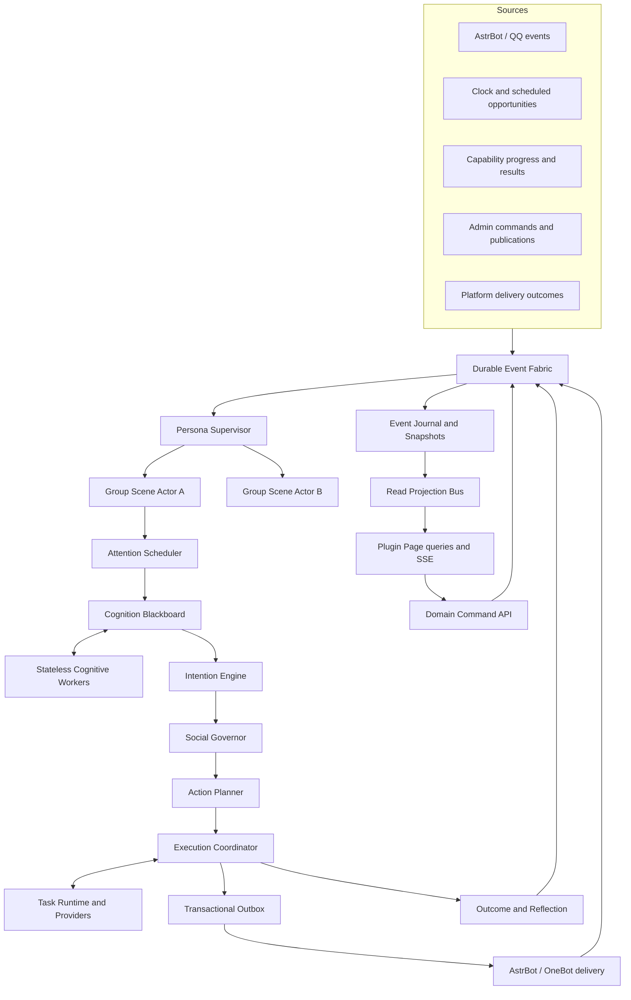

# Groupmate Social Runtime v2 Design

**Status:** Confirmed in staged review on 2026-08-18  
**Authority:** This specification supersedes the turn-centered design in `2026-08-18-groupmate-target-bot-full-redesign.md`  
**Scope:** Runtime architecture, social cognition, persona continuity, memory and learning, actions and capabilities, delivery, control plane, Plugin Page, migration, tests, and rollout

## 1. Goal

Rebuild Groupmate around a persistent social-agent runtime that can reproduce the behavioral effect of the analyzed target QQ group companion and exceed it in contextual judgment, continuity, tool reliability, privacy, and operational control.

The desired effect comes from the interaction of:

- continuous awareness of a group conversation rather than isolated request/response turns;
- contextually justified participation in open conversation;
- a stable but stateful identity;
- persistent relationships, shared experiences, and group culture;
- bounded autonomous initiation;
- natural short-form language and media use;
- coherent, persona-owned tool progress and results;
- causal, inspectable state and learning;
- deterministic authority over privacy, tools, state mutation, and sending.

The architecture must support a more intelligent companion without turning unconstrained model output into authority.

## 2. Confirmed Product Boundaries

### 2.1 Bounded autonomy

The companion may initiate without a new inbound message when there is a concrete source such as an open loop, member event, group ritual, scheduled state transition, delayed opportunity, or self commitment.

Every autonomous opportunity requires:

- evidence or a persisted goal;
- an intended group and audience;
- an earliest execution time and expiry;
- a maximum attempt count;
- revalidation against the latest group scene;
- quiet-hour, boundary, privacy, and budget checks.

Autonomy may not invent facts, farm engagement, recursively create follow-ups without evidence, or execute high-risk side effects without required confirmation.

### 2.2 Shared self, isolated relationships

Shared across groups:

- Persona Constitution;
- Self Model;
- global sleep, energy, mood, and workload;
- capability availability and global resource budgets;
- self commitments and administrator-published preferences.

Isolated by group by default:

- member identity and relationship state;
- member facts and impressions;
- shared experiences;
- group culture and inside jokes;
- raw messages;
- proactive-care evidence.

Cross-group member continuity requires an administrator-created identity link plus an allowlist of transferable data kinds. Sensitive experiences and group-specific relationships never transfer automatically.

### 2.3 Layered plasticity

- Constitution, values, stable boundaries, privacy policy, and safety policy cannot self-modify.
- Relationships, addresses, memories, impressions, culture, and open loops may learn from governed evidence.
- Attention timing, reply-length tendency, media preference, and participation weights may calibrate within administrator-defined limits after sufficient reviewed evidence.
- Models cannot rewrite prompts, code, policies, tool permissions, or safety ceilings.

## 3. Rejected Architectures

### 3.1 Prompt-only imitation

Rejected because prompt style cannot create scene awareness, autonomous timing, persistent state, task continuity, media reliability, or governance.

### 3.2 Enhanced turn workflow

Rejected as the core because one message producing one `SPEAK/SILENCE/TASK` result remains a request/response bot even after adding mood and more motives. Group meaning often emerges across several messages and multiple concurrent topics.

### 3.3 Full multi-agent society

Rejected as the default because persistent independent agents create latency, cost, state competition, and personality fragmentation. Specialized cognitive workers are allowed, but they are stateless proposal producers under one authoritative social runtime.

## 4. Architectural Principles

1. The group conversation is a persistent event stream, not a queue of chat requests.
2. One `PersonaSupervisor` owns shared self state for each persona.
3. One `GroupSceneActor` owns the social world of each persona/group.
4. Models observe, interpret, propose, summarize, and draft; they do not authorize or commit.
5. Social value, disruption, uncertainty, ownership, relationship, state, and risk jointly determine participation.
6. Silence, observation, deferral, rest, task start, failure, and expiry are first-class outcomes.
7. An action may contain text, media, tools, progress, and follow-up, but has one final-response owner.
8. Long work is asynchronous and re-enters the actor as events.
9. Every visible action has a causal event chain and an idempotent delivery record.
10. Group-facing behavior is immersive; administration is literal, transparent, and reversible.
11. Page and projection failures cannot degrade the authoritative conversational write line.
12. Existing Groupmate code is an adapter and migration source, not a constraint on the new social model.

## 5. System Topology



The only path that may authorize a group-visible action is:

```text
durable event
-> group scene
-> attention
-> cognition
-> candidate intentions
-> Social Governor
-> validated ActionPlan
-> committed outbox
-> platform delivery
```

## 6. Durable Event Fabric

### 6.1 Event envelope

All stimuli use one envelope:

```python
@dataclass(frozen=True)
class SocialEventEnvelope:
    event_id: str
    event_type: str
    occurred_at: int
    received_at: int
    persona_id: str
    group_id: str | None
    actor_id: str | None
    source_message_id: str | None
    correlation_id: str
    causation_id: str | None
    payload: Mapping[str, object]
```

Event families:

- platform messages, replies, mentions, pokes, reactions, and media;
- timer, wake, sleep, recovery, commitment, follow-up, and delayed-opportunity events;
- capability accepted, progress, success, failure, cancellation, and expiry events;
- configuration publication, correction, pause, reset, review, and rollback events;
- delivery sent, failed, unknown, expired, and suppressed events;
- consolidation and calibration events.

### 6.2 Durability and idempotency

- Events enter a durable inbox before actor processing.
- Platform deduplication uses stable source identity where available and a bounded fingerprint fallback otherwise.
- Every handler is idempotent by `event_id`.
- `correlation_id` connects one social interaction or task.
- `causation_id` makes the causal chain replayable.
- Actor acknowledgements advance an inbox cursor only after effects are committed.
- Raw-content retention is separate from structural event retention.

### 6.3 Replaying events

Replay supports:

- actor recovery;
- deterministic tests with fixed worker outputs;
- shadow comparison;
- rebuilding projections;
- investigating relationship, state, memory, task, and delivery changes.

Replay is never allowed to resend historical outbox items unless an explicit recovery state proves the original platform call was not committed.

## 7. Actor Hierarchy

### 7.1 Persona Supervisor

One supervisor exists per persona and exclusively writes:

- active Constitution and Self Model versions;
- global presence, energy, mood, irritation, and cognitive load;
- mode state shared across groups;
- global capability and generation budgets;
- self commitments;
- the registry and lifecycle of group actors.

Group actors process concurrently. They request immutable `PersonaSnapshot` values and submit bounded `GlobalStateEffect` events. The supervisor validates, clamps, deduplicates, applies, versions, and publishes accepted global changes.

### 7.2 Group Scene Actor

One actor exists for each `(persona_id, group_id)` and exclusively writes:

- active topics and topic transitions;
- participant and interaction graph;
- bot role in each topic;
- group activity and atmosphere;
- pending social opportunities;
- group-local presence rhythm;
- running task references;
- group relationships, impressions, culture, memories, and open loops through governed domain services.

The actor processes one state mutation at a time but does not block on models, capabilities, page queries, or platform delivery. External work is dispatched and returns as a new versioned event.

### 7.3 Current-code boundary

Reusable adapters:

- AstrBot and OneBot ingress;
- normalized platform primitives;
- storage utilities and migrations;
- capability provider integrations;
- privacy and authorization policies;
- outbox/platform delivery concepts;
- governance and replay data.

Not reused as V2 authority:

- the current per-message participation pipeline;
- the monolithic workflow coordinator;
- a global persona context;
- Aemeath-specific output rules as global policy;
- Plugin Page JavaScript that reconstructs domain meaning from one large snapshot.

New core code lives under `groupmate/social_runtime/`. Compatibility facades isolate old runtime types during migration.

## 8. Group World Model

```python
@dataclass(frozen=True)
class GroupWorldState:
    group_id: str
    scene_version: int
    active_topics: tuple[TopicState, ...]
    participants: tuple[ParticipantState, ...]
    interaction_edges: tuple[InteractionEdge, ...]
    group_activity: GroupActivity
    social_atmosphere: SocialAtmosphere
    bot_roles: tuple[BotTopicRole, ...]
    pending_opportunities: tuple[OpportunityRef, ...]
    running_tasks: tuple[TaskRef, ...]
    open_loops: tuple[OpenLoopRef, ...]
    recent_presence: PresenceHistory
    culture_version: int
```

The world model may contain several concurrent topics. Message recency alone never determines the target or topic.

World projectors use platform facts first, deterministic relationship/continuity rules second, and model observations only as confidence-bearing hypotheses. Model hypotheses cannot override explicit reply chains or mentions.

## 9. Attention System

### 9.1 Fast attention

Immediately creates a frame for:

- direct mention, reply, or address;
- poke or explicit interaction;
- task request or confirmation;
- boundary or safety event;
- capability result;
- administrator emergency action.

Fast attention minimizes cognition for simple cases but still uses the latest scene and authority policies.

### 9.2 Ambient attention

Collects a dynamic message window so the companion can wait for people to finish, understand parallel topics, and avoid replying to an intermediate fragment.

Window length depends on:

- group message rate;
- punctuation and continuation signals;
- reply ownership;
- topic completeness;
- bot recent presence;
- new higher-priority events.

The default profile may use roughly 1–2 seconds in a quiet group, 2–4 seconds at normal speed, and 3–6 seconds in a fast group. These are bounded policy values, not simulated thinking delays.

### 9.3 Temporal attention

Creates frames for:

- commitments and accepted tasks;
- evidence-backed follow-up opportunities;
- delayed ambient opportunities;
- sleep, wake, recovery, and daily transitions;
- group rituals and self-authored open loops.

A temporal event proposes attention; it never authorizes a send.

### 9.4 Attention frame

```python
@dataclass(frozen=True)
class AttentionFrame:
    frame_id: str
    group_id: str
    scene_version: int
    trigger_kind: str
    focus_topic_ids: tuple[str, ...]
    focus_event_ids: tuple[str, ...]
    candidate_audiences: tuple[str, ...]
    urgency: str
    deadline: int
    requested_workers: tuple[str, ...]
```

Worker results referencing obsolete scenes are rejected, revalidated, or re-requested according to trigger type. An obsolete ambient interpretation can never directly produce delivery.

## 10. Cognitive Workers and Blackboard

### 10.1 Cost levels

- Level 0: deterministic rules for deduplication, hard ownership, hard safety, and resource blockers.
- Level 1: one model pass for ordinary direct conversation and clear tasks.
- Level 2: multiple specialized workers for multi-topic, play, care, continuity, and ambiguous participation.
- Level 3: counterfactual review for sensitive, high-risk, high-value, or strongly conflicting opportunities.

### 10.2 Worker roles

- scene interpreter;
- addressee resolver;
- social-cue interpreter;
- task interpreter;
- continuity matcher;
- culture interpreter;
- opportunity critic;
- risk assessor;
- counterfactual critic;
- response drafter;
- memory and reflection candidate extractor.

Workers return only:

```python
@dataclass(frozen=True)
class CognitiveObservation:
    worker: str
    kind: str
    proposition: Mapping[str, object]
    confidence: float
    evidence_event_ids: tuple[str, ...]
    scene_version: int
    expires_at: int
    uncertainty: tuple[str, ...]
```

Workers cannot mutate state, send, execute tools, write memory, modify policies, or publish configurations.

### 10.3 Cognition Blackboard

The blackboard is scoped to one cognitive cycle and supports:

- conflicting hypotheses;
- evidence aggregation;
- fact-versus-interpretation priority;
- observation expiry;
- scene-version checking;
- uncertainty propagation;
- bounded context for intention generation.

It is not persistent memory and is discarded after the cycle is committed.

## 11. Persona Goals and Candidate Intentions

Stable goals include:

- remain consistent with identity and values;
- build reciprocal, bounded relationships;
- help when useful;
- complete accepted tasks and commitments;
- express authentic preferences;
- participate in group culture without taking over;
- protect boundaries and privacy;
- conserve energy and rest;
- observe when uncertain.

The Intention Engine may propose:

- acknowledge, answer, help, care, play, connect, express preference;
- continue topic, follow up, welcome, react to media;
- maintain boundary, accept task, report progress, deliver result;
- initiate topic, observe, or rest.

```python
@dataclass(frozen=True)
class CandidateIntention:
    intention_id: str
    kind: str
    target_id: str | None
    topic_id: str | None
    evidence_event_ids: tuple[str, ...]
    proposed_act: str
    obligation: float
    relevance: float
    relational_value: float
    continuity_value: float
    novelty: float
    urgency: float
    persona_fit: float
    state_fit: float
    information_gain: float
    disruption_cost: float
    uncertainty_cost: float
    repetition_cost: float
    resource_cost: float
    risk: float
    expires_at: int
```

## 12. Social Governor

The governor is deterministic and code-owned.

### 12.1 Hard constraints

- audience and topic ownership;
- privacy and sensitivity;
- explicit boundaries and refusal;
- group/persona pause;
- event, scene, and opportunity expiry;
- capability permission and confirmation;
- idempotency and existing task ownership;
- platform availability.

Hard constraints cannot be overridden by model confidence or utility.

### 12.2 Obligations

The governor recognizes direct reply, accepted-task reporting, commitment, boundary, and administrator-notification obligations. Required outcomes may use deterministic fallbacks; they do not guarantee unrestricted generation or tool execution.

### 12.3 Social utility

Eligible candidates are ranked by a versioned behavior profile:

```text
utility =
  obligation
  + relevance
  + relational value
  + continuity value
  + novelty
  + persona fit
  + state fit
  + information gain
  - disruption cost
  - uncertainty cost
  - repetition cost
  - resource cost
  - risk cost
```

Utility selects and ranks; it is not converted into a random reply probability.

### 12.4 Conflict, composition, and rhythm

- compatible care and help may combine;
- light media may combine with one short social act;
- boundary suppresses intimacy and play;
- task result supersedes unsent progress;
- different targets normally require separate opportunities;
- recent bot contributions, intervening human turns, topic changes, group speed, target concentration, media density, and repetition influence disruption cost.

### 12.5 Governor result

```python
@dataclass(frozen=True)
class GovernorResult:
    outcome: str  # ACT, DEFER, OBSERVE, SILENCE
    selected_intention_ids: tuple[str, ...]
    rejected: tuple[RejectedIntention, ...]
    reason_codes: tuple[str, ...]
    reconsider_at: int | None
    constraints: tuple[str, ...]
```

## 13. Persona Kernel

### 13.1 Constitution

Immutable except through administrator publication:

- identity and values;
- stable boundaries;
- stable preferences;
- speech invariants;
- safety invariants;
- allowed modes and autonomy principles.

### 13.2 Self Model

Event-backed and updateable:

- commitments and task history;
- capability availability and reliability;
- stable non-sensitive preferences;
- recurring roles across groups;
- reviewed recurring failure patterns.

### 13.3 Global self state

```python
@dataclass(frozen=True)
class GlobalSelfState:
    presence: str
    energy: int
    valence: int
    arousal: int
    irritation: int
    cognitive_load: int
    recovery_state: str
    last_transition_at: int
    next_transition_at: int | None
    version: int
```

Raw numeric state is never exposed in group replies. State influences attention, intention salience, length, modality, autonomy, concurrency, and boundaries.

### 13.4 Mode Director

Mode is composed from one primary mode and bounded modifiers:

```python
@dataclass(frozen=True)
class PersonaModeState:
    primary: str  # social, focused_task, quiet_observer, boundary
    modifiers: tuple[str, ...]  # playful, warm, drowsy, irritated
    activated_by: tuple[str, ...]
    expires_at: int | None
```

Transitions require events, schedules, workload, or administrator commands. Random per-turn mode changes are forbidden.

### 13.5 State effects

Models may propose state effects with evidence. A code-owned transition policy validates evidence, clamps changes, applies cooldown and decay, deduplicates causation, and emits versioned accepted effects.

Silence from a member is not negative evidence. One emoji does not create a long-term mood or relationship change.

## 14. Relationships, Impressions, Culture, and Memory

### 14.1 Relationship state

Relationship is a projection over evidence events with dimensions for familiarity, warmth, trust, reciprocity, playfulness, reliability, care permission, and boundary pressure.

Relationship never grants platform or capability permissions.

### 14.2 Social impressions

Impressions are confidence-bearing, group-scoped understandings such as preferred address, interests, interaction style, teasing tolerance, routine, sensitivity, group role, and recurring relationship pattern.

Each impression carries evidence, status, expiry, and independent permissions to influence address, tone, participation, care, or suggestions.

### 14.3 Group culture

Culture artifacts include recurring jokes, local abbreviations, rituals, role relationships, common topics, humor limits, group rhythm, and expectations of the companion.

One occurrence normally remains episodic. Recurrence or administrator confirmation is required for accepted group culture. Artifacts decay and never cross groups by default.

### 14.4 Memory layers

- working memory: one cognition cycle and active scene;
- episodic memory: timestamped interactions and shared events;
- semantic memory: stable facts with provenance and validity;
- relational memory: evidence events and projections;
- procedural social memory: group-level interaction preferences;
- self memory: tasks, commitments, successes, failures, and reviewed preferences.

### 14.5 Write pipeline

```text
real event
-> candidate extraction
-> entity resolution
-> privacy and scope
-> contradiction check
-> importance and durability
-> authority decision
-> accept, stage for review, or reject
```

Generated replies cannot prove user facts. Summaries retain evidence references. Contradictions are versioned or staged, not blindly overwritten. Sensitive facts are not stored automatically by default. Deletion creates a tombstone that prevents automatic relearning of equivalent content.

### 14.6 Retrieval

Retrieval is intention- and audience-driven:

```text
intent and target
-> permitted scopes
-> memory types
-> relevance, recency, confidence, and diversity
-> sensitivity filtering
-> conflict marking
-> token budget
-> typed context block
```

The generator never receives an unrestricted dump of stored records.

### 14.7 Learning and consolidation

Online learning updates event-backed short state and candidates. Periodic consolidation merges duplicate episodes, detects contradiction, decays impressions, promotes recurring culture, closes completed loops, and stages anomalies for review.

Behavior calibration may adjust only allowlisted group parameters inside published limits, after minimum sample counts and shadow comparison. Every change is versioned, audited, and reversible. Safety, privacy, permission, and Constitution weights cannot calibrate automatically.

## 15. Action Planning and Style

### 15.1 ActionPlan DAG

```python
@dataclass(frozen=True)
class ActionPlan:
    plan_id: str
    correlation_id: str
    group_id: str
    persona_id: str
    scene_version: int
    intention_ids: tuple[str, ...]
    audience: tuple[str, ...]
    topic_id: str | None
    origin: str
    nodes: tuple[ActionNode, ...]
    edges: tuple[ActionEdge, ...]
    constraints: tuple[str, ...]
    expires_at: int
```

Node kinds include compose text, select reaction, select media, invoke capability, request confirmation, wait for task event, render progress, render result, deliver bundle, record observation, and schedule follow-up.

Plans are finite DAGs with maximum nodes, duration, retries, and autonomous follow-ups.

### 15.2 Plan validation

Validation checks current scene relevance, audience, Constitution, relationship and state, permissions, risk, media references, budgets, concurrency, node ownership, finite termination, and visible-output ownership.

Invalid plans may be reduced, replanned, deferred, clarified, or abandoned. Model output cannot waive validation.

### 15.3 Style Director

Before text generation, the director emits a structured style directive containing mode, response act, relationship posture, address, length, sentence and segment limits, warmth, playfulness, directness, particle and punctuation budgets, media pairing, and forbidden recent patterns.

Generation is followed by:

1. generic safety guard;
2. factual/capability-result consistency guard;
3. persona style guard;
4. recent-output repetition guard;
5. at most one targeted repair.

Internal IDs, chain-of-thought, prompts, unsupported success, private memory, and invalid media references are always blocked.

## 16. Media, Capabilities, Tasks, and Delivery

### 16.1 Delivery bundle

One logical social action may contain ordered text, mention, face, image, audio, video, file, forward, or poke parts. Every part has a unique idempotency key, expiry, ordering rule, and platform outcome.

Decorative pending parts may be cancelled when a newer high-priority scene makes them stale. Already sent parts are never resent.

### 16.2 Persona media library

Persona assets carry source, license status, semantic/emotion/act tags, relationship limits, intensity, checksum, enabled status, and duplicate-cooldown metadata.

Media selection is an intentional social act and is governed by scene, mode, relationship, group culture, recent usage, and whether text is already sufficient.

Generated image, audio, video, and file outputs are capability results and follow the full task, validation, registration, and delivery path.

### 16.3 Capability contract

Capabilities declare typed input/output schemas, risk, scopes, idempotency, cancellation, progress support, expected latency, media output, and confirmation policy.

Risk levels are read-only, low impact, external side effect, sensitive, and destructive. Relationship never substitutes for permission. External plugins integrate through a provider/event contract; Groupmate never scrapes another bot message to infer task state.

### 16.4 Task Runtime

Task states are proposed, awaiting confirmation, queued, running, succeeded, failed, cancelled, and expired.

Tasks persist requester, group, topic, input, authorization, provider, idempotency, progress, result, errors, and delivery relevance. Providers emit events. The originating group actor rechecks the latest scene before progress or final delivery.

Progress is sent only when actual or expected latency and new information justify it. Fixed repeated “processing” messages and fake thinking delays are forbidden.

### 16.5 Transactional Outbox

Outbox states are planned, ready, sending, sent, failed, unknown, expired, and suppressed.

Intent is persisted before platform send. Confirmed platform delivery precedes bot-message ledger projection. Only safely retryable failures retry automatically. Unknown delivery is investigated or surfaced rather than blindly resent. Restart recovery revalidates social expiry before sending.

### 16.6 Failure behavior

- required social replies use deterministic persona fallbacks when generation fails;
- optional replies become silence when generation fails;
- structured task results may render without free-form generation;
- only idempotent policy-approved tool failures retry;
- partial delivery records exact successful parts;
- page, projection, and SSE failures do not cancel tasks or actor processing;
- stale results may complete silently rather than interrupt an unrelated current scene.

## 17. Control Plane and Configuration

### 17.1 Configuration precedence

```text
code safety ceilings
-> AstrBot deployment configuration
-> Persona Constitution version
-> group behavior version
-> current state and scene
```

AstrBot `_conf_schema.json` retains providers, secrets, storage paths, enabled groups, hard ceilings, and provider availability. Secrets never enter Plugin Page projections.

### 17.2 Draft and publication

Behavior configuration uses draft, schema validation, policy validation, historical dry-run, semantic diff, expected-version publication, immutable published version, and audited restore-by-republication.

An in-flight cognition cycle keeps its frozen version. New cycles use the newly published version. Failed publication preserves the draft. Version conflicts return HTTP 409.

### 17.3 Command-query separation

Queries read versioned projections. Mutations submit commands that validate administrator identity, scope, input, expected version, confirmation, and reason before calling domain services and emitting events.

The Plugin Page never writes domain tables or reconstructs authoritative decisions in JavaScript.

## 18. AstrBot Plugin Page

### 18.1 Visual and interaction model

Use a restrained ChatGPT-like product shell:

- compact stable left navigation;
- contextual top bar for group, persona, version, live status, and pause;
- spacious text-first main pane;
- optional right-side inspector;
- botanical green only for primary, selection, and healthy states;
- no fictional consciousness dashboard, glassmorphism, hero metrics, or card farm;
- complete AstrBot light/dark theme support, i18n, reduced motion, 200% zoom, and responsive behavior.

### 18.2 Workspaces

1. Runtime Center: narrative state summary, live activity, tasks, health, and emergency controls.
2. Persona Studio: Constitution, state and modes, attention, autonomy, Governor, style, media, tools, drafts, diffs, and dry-run comparison.
3. People & Memory: identity, relationship, impressions, experiences, facts, open loops, commitments, culture, and governance history.
4. Activity & Tasks: filtered causal timeline, decision inspector, ActionPlan, task events, delivery parts, and failures.
5. Governance & Evaluation: pending reviews, correction, forgetting, identity links, configuration history, calibration, export, retention, and target alignment.

### 18.3 Frontend architecture

Keep a no-build native ES-module frontend unless implementation evidence proves insufficient. Split the current page into bridge, router, store, i18n, components, workspace modules, and theme/responsive styles. Use hash routes in the restricted AstrBot iframe.

### 18.4 Query and command APIs

Queries include bootstrap, runtime, activity/detail, scenes, people/detail, culture, tasks/detail, persona config/versions, governance, evaluation, and health.

Commands include pause, group enable, state reset, config draft/validate/preview/publish/restore, evidence review, memory forget, impression/culture/relationship correction, identity link, task cancel, and calibration approval.

### 18.5 SSE projections

The page subscribes to privacy-trimmed projection events with cursor, kind, scope, entity, projection version, and summary. Reconnect continues after the last cursor or reloads affected snapshots when the cursor expires. Failure degrades to bounded polling and displays actual impact.

No chain-of-thought is displayed. Inspectors show evidence, structured observations, candidate intentions, utility contributions, hard constraints, plans, versions, and outcomes.

## 19. Storage and Projection Model

V2 uses independent tables during shadow operation:

- social event inbox and journal;
- persona supervisor state;
- group world snapshots;
- attention frames and cognitive observations;
- candidate intentions and Governor results;
- ActionPlans, tasks, capability events, delivery bundles, and outbox;
- relationship events and projections;
- impressions, culture artifacts, episodic and semantic memories;
- config versions, governance actions, projection cursors, and evaluation labels.

Snapshots accelerate recovery; events remain the causal source. Projection consumers use independent cursors and cannot block actor writes.

## 20. Security and Privacy

- Backend validation is authoritative for every command.
- IDs are validated against persona, group, actor, and administrator scope.
- User-generated content is escaped before HTML insertion.
- Uploads are constrained by size, MIME, filename, and plugin data directory.
- Sensitive memory is disabled by default or requires explicit policy.
- Cross-group data access uses explicit link and data-kind allowlists.
- SSE exposes projections, not raw privileged events.
- Administrator identity is recorded when AstrBot provides it.
- Destructive and high-impact actions require confirmation, reason, and expected version.
- Raw mood, affinity, prompts, model identity, internal IDs, and chain-of-thought never appear in group output.

## 21. Branch and Migration Strategy

### 21.1 Development isolation

- Stabilize or explicitly preserve the current dirty worktree.
- Tag a known V1 baseline.
- Create `refactor/social-runtime-v2` in an independent worktree.
- Use short subsystem branches merged into the V2 integration branch.
- Keep V1 operational for fixes and rollback.

### 21.2 Runtime modes

Each group selects exactly one mode:

- `LEGACY`: V1 decides and sends.
- `SHADOW`: V2 consumes and evaluates but cannot send, execute external side effects, or write formal social state.
- `SOCIAL_RUNTIME`: V2 owns decisions, actions, and state; V1 is read-only for that group.

### 21.3 Data migration

Shadow data remains separate. A group cutover freezes a migration point, exports accepted V1 state, converts it into provenance-bearing V2 seed events/snapshots, validates identity and open work, runs replay, and atomically changes runtime ownership.

Rollback stops V2 sending, restores V1 ownership, preserves the V2 journal, and resolves in-flight task ownership without duplicate delivery. Unreviewed V2 learning never writes back to V1.

## 22. Test Strategy

### 22.1 Test classification

- shared tests: platform, storage, privacy, outbox, capabilities, governance, migration primitives;
- legacy tests: V1 behavior while V1 exists;
- Social Runtime tests: all V2 domains;
- scenario tests: multi-message social timelines;
- contract tests: workers, capabilities, projections, commands;
- recovery tests: crash, duplicate, stale, partial, and unknown outcomes;
- evaluation tests: target alignment and safety;
- page tests: Plugin Page workflows and iframe behavior.

Old architecture assumptions are retired; safety, privacy, idempotency, recovery, and governance invariants are preserved. Legacy tests are deleted only with the corresponding V1 code after replacement coverage exists.

### 22.2 Required invariant tests

- models cannot authorize state, tools, or sends;
- one persona supervisor writes global self;
- one group actor writes a group world;
- duplicate events do not duplicate effects;
- a hard constraint cannot be outweighed by social utility;
- one cognitive cycle uses one frozen config version;
- ActionPlans are finite and terminating;
- every visible part has decision, plan, bundle, and idempotency identity;
- group-private data cannot cross groups without explicit authorization;
- page/projection failure cannot change conversational behavior;
- replay cannot resend confirmed historical output.

### 22.3 Scenario coverage

Direct interaction, multi-message completion, parallel topics, public help, play, care, shared experience, media reaction, task progress, boundary, sleep/wake, autonomous initiation, expired opportunities, topic change during a task, ambiguous target, and correct silence.

## 23. Target Alignment Evaluation

The bot-only export is valid for style, segmentation, persona modes, media, and capability distribution. Participation timing requires full group history with human messages.

Create held-out labels for notice, action, target, acceptable intentions, unacceptable intentions, modalities, sensitivity, and expiry.

Metrics cover:

- event notice and target accuracy;
- open-participation precision and missed-opportunity rate;
- interruption, monopoly, repetition, and target-concentration rates;
- autonomous-action value and expiry correctness;
- identity, relationship posture, mode, address, and culture accuracy;
- memory, impression, privacy, forgetting, and calibration quality;
- tool selection, authorization, completion, progress, delivery, duplication, and recovery;
- reply length, segmentation, particles, address density, media relevance, and mode separability;
- zero internal-ID, chain-of-thought, private cross-group, and unauthorized-action incidents.

## 24. Delivery Milestones

1. M0 baseline, worktree, test classification, V1 benchmark, and architecture guards.
2. M1 durable event fabric, inbox, journal, replay, and projection cursors.
3. M2 supervisor, group actors, world state, snapshots, and runtime modes.
4. M3 three-lane attention, blackboard, workers, version/expiry handling.
5. M4 Persona Goals, intentions, Social Governor, and shadow participation.
6. M5 Persona Kernel, state, relationships, impressions, culture, memory, consolidation, and bounded calibration.
7. M6 ActionPlan, StyleDirector, media, capabilities, tasks, outbox, and recovery.
8. M7 command/query control plane, config versions, SSE, and redesigned Plugin Page.
9. M8 full-history shadow evaluation, human review, fault injection, cost, latency, and backpressure.
10. M9 allowlisted per-group cutover with immediate rollback.
11. M10 V1 retirement after compatibility and acceptance gates.

Each milestone must produce independently testable working software. Migrations and compatibility belong to the milestone that introduces the persisted or public interface.

## 25. Production Gates

V2 cannot own a production group until:

- internal ID, chain-of-thought, cross-group private leak, and unauthorized tool counts are zero in required suites;
- duplicate event and crash recovery do not duplicate effects or sends;
- ActionPlan termination and config snapshot consistency are proven;
- shadow target selection and interruption metrics meet reviewed thresholds;
- every autonomous action has source, audience, expiry, and reason;
- page pause, inspection, publication, correction, and rollback work in AstrBot's iframe;
- one group can return to V1 without dual reply;
- in-flight tasks have an explicit ownership transition plan;
- actor backlog, Worker cost, and projection lag remain within published operational budgets.

## 26. V1 Retirement Conditions

V1 code and its behavior-specific tests may be removed only when:

- every enabled group has migrated or is explicitly pinned to a supported legacy release;
- V2 passes target, safety, recovery, and governance gates;
- no capability or page workflow is V1-only;
- V2 restore drills pass;
- shared fixtures and invariants have replacement coverage;
- a compatibility release has elapsed;
- data export and rollback instructions are documented.

## 27. Non-Goals

- Exact copying of the target bot's identity, private lore, or training text.
- Random reply probability as the primary social decision.
- Full multi-agent autonomy or multiple final-response owners.
- Online self-modification of code, Constitution, privacy, permissions, or safety.
- Automatic cross-group sharing of member data.
- Fake thought delays, fake tool progress, or theatrical consciousness metrics.
- A simultaneous all-group cutover.
- Deleting V1 tests before the corresponding V1 implementation and replacement coverage are removed together.

