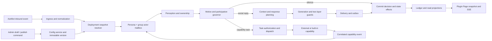

# Groupmate 目标 Bot 全面重构设计 — 已废弃

> **请勿实施本规格。** 架构评审后，其中以 Turn 为中心的运行时已经被以群场景为中心的 Social Runtime v2 取代。当前唯一权威规格为 [`2026-08-18-groupmate-social-runtime-v2-design.md`](./2026-08-18-groupmate-social-runtime-v2-design.md)。下方英文内容仅作为早期设计决策记录保留。

**状态：** 2026-08-18 已废弃
**替代文档：** Groupmate Social Runtime v2 中文设计规格
**产品：** `astrbot_plugin_groupmate`

## 1. Purpose

Refactor Groupmate so it can reproduce the *behavioral effect* of the analyzed target QQ group bot while preserving Groupmate's stronger safety, memory authority, auditability, and deterministic delivery guarantees.

The target effect is not a collection of catchphrases. It is the combined result of:

- frequent but contextually justified presence in open group conversation;
- a stable identity with recognizable short-form speech;
- persistent per-member relationships and shared social history;
- visible but rule-backed states such as sleep, energy, mood, and cooldown;
- coherent transitions between conversation, media reaction, and tool work;
- progress, completion, and failure messages that all belong to the same character;
- configurable per-group behavior and operational transparency for administrators.

The redesign must keep the group-facing character immersive and the administration surface literal, professional, and inspectable.

## 2. Current-System Assessment

The existing project already provides reusable foundations:

- one actor per persona/group and ordered event processing;
- direct-address, ownership, pressure, and anti-monopoly checks;
- persistent profiles, nickname history, relationships, memories, continuity items, and commitments;
- capability discovery, policy checks, execution, persona rendering, delivery, and outbox recording;
- reversible governance actions and decision traces;
- an AstrBot Plugin Page with custom Web APIs;
- shadow replay and deterministic evaluation infrastructure.

The primary gaps are:

1. Open participation only implements concrete public help. Other declared motives never produce speech.
2. Persona selection and output policy are effectively global and Aemeath-specific.
3. There is no persisted persona presence, energy, sleep, or causal mood state.
4. Long-term memory does not model bounded social impressions or shared jokes.
5. Host commands and external plugin results do not form one continuous character-owned task lifecycle.
6. Outbound media types are too narrow for the target effect.
7. The current Plugin Page has grown into eleven peer-level modules and mixes monitoring, editing, diagnosis, and recovery.
8. The frontend is concentrated in three files, including a monolithic `app.js`, and does not yet use the current AstrBot theme, i18n, SSE, upload, and download facilities.

## 3. Product Principles

### 3.1 Mechanism fidelity over phrase imitation

Reproduce why the target bot feels present, not its name, lore, or exact catchphrases. A new behavior profile can be paired with Aemeath or another persona definition.

### 3.2 Causal state, never random theater

Mood, sleep, energy, and irritation must change because of events, schedules, resource use, or recovery. Random reply probability and fabricated intelligence scores are not acceptable substitutes.

### 3.3 Model proposes; code authorizes

Models may classify motives, summarize evidence, draft text, and choose among already-authorized capabilities. Code retains authority over ownership, privacy, budgets, state transitions, tool permissions, sending, persistence, and destructive actions.

### 3.4 One final-response owner

Conversation, progress, tool results, media, fallbacks, and failures must use a correlated task lifecycle and one delivery owner. Other plugins may provide capabilities but must not create an unrelated second personality.

### 3.5 Per-group deployment with versioned change

Behavior is configured and published per group. Changes use draft, validation, preview, immutable version, publish, and rollback semantics.

### 3.6 Immersive group chat, transparent administration

Group messages do not disclose prompts, models, internal IDs, or scores. The Plugin Page shows the actual mechanisms, evidence, limits, and failures without roleplay terminology.

## 4. Considered Approaches

### 4.1 Prompt-only imitation

Add target samples and style instructions to the current Aemeath prompt.

This is rejected because it cannot create open participation, persistent state, task continuity, media support, or auditable per-group control. It would also encourage surface-level phrase copying.

### 4.2 Separate target-bot plugin

Build a new AstrBot plugin with a fresh runtime and copy only selected Groupmate ideas.

This is rejected because it would duplicate the actor, memory, policy, capability, delivery, governance, and evaluation systems and would regress safety and maintainability.

### 4.3 Refactor Groupmate into a persona-pluggable social runtime

Keep the existing core and introduce behavior profiles, per-group deployment, persisted runtime state, social impressions, unified capability events, and a redesigned operational page.

This is the selected approach.

## 5. Scope Decomposition

The work is divided into five independently reviewable subprojects:

1. **Persona deployment and versioned configuration foundation**
2. **Open participation, runtime state, and social impressions**
3. **Unified task lifecycle, external capabilities, and media delivery**
4. **AstrBot Plugin Page rearchitecture and behavior studio**
5. **Target alignment evaluation, migration, and staged rollout**

Each subproject must ship usable, tested behavior without requiring an incomplete later subproject to keep the plugin operational.

## 6. Target Architecture

### 6.1 Runtime pipeline

```text
AstrBot event
  -> normalized group event
  -> topic and addressee resolution
  -> deterministic blockers
  -> motive assessment
  -> presence/state/budget governor
  -> participation decision
  -> memory and social-impression recall
  -> response act or capability plan
  -> generic safety guard + persona style guard
  -> task-aware delivery
  -> ledger, relationship evidence, state update, and audit
```

No later stage may bypass an earlier ownership, privacy, or authorization decision.

#### 6.1.1 Main core line and controlled side channels

The architecture has one authoritative write line and three controlled side channels:



Only the actor line from ingress through commit may create a participation decision or authorize a group-visible send. The side channels operate as follows:

1. **Capability side channel:** performs authorized asynchronous work and returns a correlated event to the actor mailbox. It cannot send a final group message directly.
2. **Administration command channel:** validates drafts, publishes immutable configuration versions, and performs audited corrections. A published version is observed by the next actor turn; it does not mutate an in-flight turn.
3. **Projection query channel:** builds read models and SSE events from committed records. The Plugin Page never writes domain tables directly.

#### 6.1.2 Turn envelope and frozen deployment snapshot

Every admitted inbound event creates a `TurnEnvelope`:

```python
@dataclass(frozen=True)
class TurnEnvelope:
    event_id: str
    decision_id: str
    actor_key: tuple[str, str]
    persona_id: str
    group_id: str
    deployment_version_id: str
    source_message_id: str
    received_at: int
```

The deployment version is resolved before the event enters the actor and remains frozen for the entire turn. Context assembly, participation, generation, tool authorization, output guards, delivery, and state effects all record the same `decision_id` and `deployment_version_id`.

This prevents a configuration publish from changing half of an in-progress decision and makes exact replay possible.

#### 6.1.3 Authoritative actor turn

The actor processes one hard turn at a time for each `(persona_id, group_id)`. Soft candidates may be coalesced before processing, but once admitted the turn follows these stages:

1. **Observe**
   - normalize message, reply, mention, poke, media, command-bridge, timer, and capability-result events;
   - deduplicate by platform event and message identity;
   - append the inbound observation to the conversation ledger.

2. **Resolve deployment and topic**
   - load the frozen per-group persona/behavior configuration;
   - select active topic messages and current bot presence;
   - resolve reply audience, social target, task owner, and ambiguity.

3. **Perceive**
   - classify trigger, scene, pressure, task request, continuity match, and candidate social events;
   - compute deterministic ownership and safety blockers;
   - create a bounded `PerceptionSnapshot` without mutating relationships or memories.

4. **Assess motive**
   - evaluate deterministic motive signals;
   - invoke the compact motive classifier only for unresolved eligible candidates;
   - return typed motives, evidence IDs, social target, confidence, and reason codes.

5. **Govern participation**
   - combine direct obligation, motive, relationship posture, runtime presence, energy, irritation, per-user cooldown, group budgets, topic ownership, and monopoly limits;
   - emit exactly one immutable outcome: `SPEAK`, `SILENCE`, or `START_TASK`;
   - reserve required resource budget atomically when the outcome will generate or act.

6. **Assemble authorized context**
   - recall only data allowed for the resolved audience and response act;
   - combine persona identity, behavior profile, topic context, member profile, relationship posture, accepted impressions, relevant memories, continuity, commitments, runtime state, and available capabilities;
   - apply per-block count and token budgets before prompt construction.

7. **Plan response or action**
   - select response act, reply mode, contribution, quote policy, media policy, and capability plan;
   - for a social reply, proceed to generation;
   - for a capability request, create and dispatch a `TaskRun` and finish the current actor turn after any justified acknowledgement;
   - for silence, skip generation and proceed to commit.

8. **Generate and guard**
   - generate from the typed context and explicit response act;
   - run the generic safety guard followed by the selected persona style guard;
   - allow one bounded repair attempt when repairable;
   - use a deterministic persona fallback for direct obligations when generation remains unavailable;
   - never turn a failed optional generation into a compulsory message.

9. **Deliver**
   - build one delivery plan containing quote, text segments, mentions, media, and expiry;
   - write the outbox record before platform send;
   - enforce idempotency by `decision_id` and delivery-part identity;
   - record each actual platform outcome.

10. **Commit effects**
    - commit the immutable decision trace regardless of speech or silence;
    - project runtime-state consumption and recovery events;
    - accept relationship, memory, impression, and continuity evidence only according to their separate authority rules;
    - record delivered bot messages in the ledger only after confirmed delivery;
    - publish projection events for the Plugin Page.

The commit stage is the only place where a turn's derived social state becomes durable. A model-generated claim is never itself evidence.

#### 6.1.4 Asynchronous capability return loop

A capability branch never resumes an old Python call stack. It returns a new typed event to the same actor:

```text
TaskRun created
  -> provider accepts
  -> zero or more progress events
  -> success / failure / cancellation event
  -> actor reloads current topic and deployment
  -> checks task ownership, expiry, and delivery relevance
  -> generates persona-owned progress or final response
  -> guards, delivers, and commits through the normal line
```

The task retains the originating `decision_id`, while every progress or result turn receives its own `decision_id`. This preserves causality without treating a stale tool result as if it were still the current conversation.

Progress is coalesced and rate-limited. A final result supersedes queued progress. If the requester leaves, the topic changes materially, or the result expires, the actor may record completion without sending it to the group.

#### 6.1.5 Configuration command line

The Plugin Page does not edit runtime objects. Configuration writes pass through a domain service:

```text
page command
  -> request validation and administrator identity
  -> draft schema validation
  -> policy ceiling validation
  -> dry-run preview
  -> expected-base-version check
  -> immutable version write
  -> atomic deployment-pointer update
  -> governance action and SSE notification
```

Actor turns already in progress keep their frozen version. New turns resolve the new published version. Rollback republishes an older snapshot as a new version; history is never rewritten.

#### 6.1.6 Read projection line

The page reads purpose-built projections rather than assembling operational truth in JavaScript. Projection builders consume committed decisions, deliveries, state transitions, task events, evidence, and configuration publications to produce:

- runtime-center summary;
- live activity feed;
- persona draft/published diff;
- member workspace;
- decision and task inspector;
- quality and target-alignment metrics;
- governance history.

Snapshot endpoints and SSE use the same projection schemas. An SSE event contains a projection cursor; reconnect requests events after that cursor or reloads the affected snapshot when the cursor has expired.

#### 6.1.7 Core invariants

The implementation must preserve these invariants:

1. One actor is the single writer for conversational decisions within a persona/group.
2. Every group-visible send belongs to a committed `decision_id`; task output also carries a `task_id`.
3. A turn uses exactly one immutable deployment version.
4. LLM output cannot mutate state, authorize tools, or send messages directly.
5. External capability providers cannot own the final group response.
6. No memory, impression, or relationship change is accepted solely because generated text stated it.
7. Outbox intent precedes platform send, and confirmed delivery precedes bot-message ledger projection.
8. Silence, task start, tool failure, expired result, and delivery failure are first-class outcomes.
9. Plugin Page mutations use domain commands, optimistic concurrency, and governance records.
10. Projection or SSE failure cannot affect the conversational write line.

#### 6.1.8 Mapping to current code

The main line reuses and narrows current modules rather than placing more responsibility in `workflow.py` or `bridge.py`:

| Core responsibility | Existing base | Target boundary |
| --- | --- | --- |
| AstrBot admission | `host/event_gate.py`, `host/ingress.py` | Normalize only; no social decision |
| Deployment resolution | `persona/registry.py`, `host/bridge.py` | New per-group resolver returns frozen version |
| Actor serialization | `engine/runtime.py` | Sole conversational writer and async-result re-entry |
| Perception/ownership | targeting, scene, pressure modules | Produce typed immutable perception |
| Participation | `engine/participation.py` | Eligibility, motive assessment, and state governor as separate units |
| Context | `core/context_assembly.py` | Consume authorized typed blocks only |
| Response orchestration | `engine/workflow.py` | Thin coordinator; domain stages move to focused services |
| Capabilities | `tools/`, `capabilities/` | Persistent task lifecycle and correlated event return |
| Guarding | persona output firewall | Shared safety guard plus persona style guard |
| Delivery | `engine/delivery.py`, outbox | All text and media through one idempotent owner |
| Durable social state | `memory/store.py`, social modules | Event-backed projections and bounded repositories |
| Admin APIs | `host/web_api.py` | Validate and call domain command/query services only |
| Plugin Page | `pages/settings/` | Consume projections and commands; no domain reconstruction |

`engine/workflow.py`, `host/bridge.py`, and `memory/store.py` are already large. The refactor must extract new focused services while keeping compatibility facades during migration.

### 6.2 Persona definition and behavior profile

`PersonaDefinition` becomes a composition root rather than an Aemeath-only prompt factory. It contains:

- `persona_id` and display identity;
- aliases and prompt-provider factory;
- participation-profile factory;
- generic-safety and persona-style guard factories;
- runtime-state policy;
- speech-style profile;
- media-reaction policy;
- capability-presentation policy.

Identity and behavior are separate concepts. The initial registry contains:

- `aemeath` identity;
- `restrained`, `balanced`, and `lively_group` behavior profiles.

The default after migration remains the current Aemeath/restrained behavior until an administrator publishes another profile.

### 6.3 Per-group deployment

Every enabled group resolves a `GroupPersonaDeployment`:

```python
@dataclass(frozen=True)
class GroupPersonaDeployment:
    group_id: str
    persona_id: str
    behavior_profile_id: str
    published_version_id: str
    config: "PublishedBehaviorConfig"
```

Actor identity remains `(persona_id, group_id)`. The bridge must resolve deployment for each event instead of storing one global `persona_context`.

### 6.4 Open participation

Open participation uses two stages.

#### Deterministic eligibility

Reject or defer when:

- another user owns the reply or mention;
- the source is a host command without a registered capability bridge;
- the event is duplicate, stale, ambiguous, or an empty echo;
- the bot recently monopolized the same topic;
- the group or persona is paused, asleep, or budget-exhausted;
- the member is under an interaction cooldown;
- the relationship or boundary state prohibits the candidate act.

#### Motive assessment

Return a typed assessment:

```python
@dataclass(frozen=True)
class MotiveAssessment:
    primary: ParticipationMotive | None
    secondary: tuple[ParticipationMotive, ...]
    confidence: float
    evidence_message_ids: tuple[str, ...]
    proposed_social_target_id: str | None
    reason_codes: tuple[str, ...]
```

Supported motives are:

- concrete help;
- evidence-backed care;
- invited play;
- relevant preference;
- group-context connection;
- continuation of a bot-owned thread;
- continuity follow-up;
- meaningful media reaction.

Deterministic signals are evaluated first. A compact classifier is used only for candidates that remain ambiguous. The final governor applies behavior-profile permissions, relationship posture, runtime state, frequency budgets, and contribution value.

### 6.5 Persona runtime state

Persist one state row per persona/group:

- presence: `awake`, `drowsy`, `asleep`, `busy`, `paused`;
- energy: integer 0–100;
- mood valence: integer -100–100;
- mood arousal: integer 0–100;
- irritation: integer 0–100;
- local day key;
- daily optional-send, direct-send, generation, media, and tool counts;
- last state transition and reason;
- next scheduled transition.

State rules:

- direct addresses remain required while awake unless a safety or hard resource gate blocks them;
- sleep suppresses optional speech and can produce at most one bounded status response to direct wake attempts;
- energy is consumed by optional speech and resource-heavy actions and recovers by policy;
- mood changes only from accepted social events and decays toward neutral;
- irritation rises from verified pressure or boundary violations and decays slowly;
- no raw mood or affinity score is injected into group-visible output;
- administrators can inspect state causes and perform an audited reset.

### 6.6 Social impressions

Add a separate bounded store for impressions that are socially useful but should not be promoted to facts automatically.

An impression contains:

- persona, group, and subject IDs;
- kind: address preference, recurring interest, interaction style, relationship role, shared joke, sensitivity, or routine;
- concise summary;
- confidence and status;
- source message references;
- first/last observed timestamps;
- expiry or review timestamp;
- whether it may influence address, tone, participation, or care.

Only accepted or high-confidence impressions are injected. Injection is capped by count and token budget. Administrators can confirm, edit, reject, expire, and restore impressions through audited actions.

### 6.7 Output policy

Output validation is split into:

1. **Generic safety guard**
   - internal ID and prompt leakage;
   - `<think>` or reasoning leakage;
   - unsupported success claims;
   - premature commitment completion;
   - private-memory leakage;
   - invalid media references.

2. **Persona style guard**
   - length and segment limits by response act;
   - allowed interjections and decorative punctuation;
   - relationship-appropriate address and intimacy;
   - repetition and catchphrase quotas;
   - persona-specific forbidden patterns.

The lively profile may permit bounded soft particles and wave punctuation. These allowances are not applied globally to Aemeath's restrained profile.

### 6.8 Unified task and capability lifecycle

Introduce a persistent `TaskRun` correlated with group, requester, source message, persona, and capability:

```text
queued -> running -> succeeded
                  -> failed
                  -> cancelled
                  -> expired
```

Each task records progress events, external provider correlation IDs, authorization outcome, final delivery, and error classification.

External plugins integrate through a typed capability-event bridge instead of command-output scraping. A provider may report accepted, progress, result, failure, and media events. Groupmate remains responsible for persona rendering and final delivery ownership.

Progress messages are emitted only when measured or expected latency exceeds a configured threshold. Random long sleeps are forbidden.

### 6.9 Media delivery

Extend outbound kinds with audio, video, file, and forward-message support while preserving current text, mention, image, poke, and face kinds.

Add a governed media-reaction provider:

- persona-owned asset catalog;
- scene, act, relationship, and mood tags;
- per-group and per-user cooldown;
- duplicate suppression;
- safe local references or provider-returned references;
- delivery outcome recorded in the ledger.

Media is selected only after a participation decision. It never creates its own authority to speak.

## 7. Configuration Ownership and Versioning

### 7.1 AstrBot native configuration

`_conf_schema.json` remains the source for deployment-level values:

- enabled groups and global emergency disable;
- provider identifiers and model wiring;
- secrets and credentials;
- database and storage paths;
- capability-provider availability;
- global hard safety ceilings.

Secrets are never returned through Plugin Page APIs.

### 7.2 Plugin Page configuration

The custom page owns behavior configuration:

- persona and behavior profile per group;
- aliases and group-visible identity options;
- participation motives and presets;
- sleep schedule and wake behavior;
- energy and daily optional-send policy;
- state sensitivity and decay policy within hard ceilings;
- expression and media policy;
- capability presentation and progress thresholds;
- social-impression and proactive-care policy.

### 7.3 Draft and publish flow

```text
published version
  -> create/update draft
  -> schema and policy validation
  -> dry-run preview against scenarios
  -> diff review
  -> publish with expected base version
  -> immutable published version
  -> audited rollback by republishing an older snapshot
```

Concurrent writes use an expected version or ETag and return HTTP 409 on conflict. A failed publish never discards the draft.

## 8. Data Model

Add migrations for:

### `group_persona_deployments`

- `group_id` primary key
- `persona_id`
- `behavior_profile_id`
- `published_version_id`
- `enabled`
- `created_at`, `updated_at`

### `persona_config_versions`

- `version_id` primary key
- `group_id`
- `parent_version_id`
- `status`: draft, published, superseded
- `schema_version`
- `config_json`
- `config_checksum`
- `created_by`, `created_at`
- `published_by`, `published_at`

Only one draft and one current published version may exist per group.

### `persona_runtime_states`

- composite primary key `(persona_id, group_id)`
- state fields and counters defined in section 6.5
- `version` for optimistic concurrency

### `social_impressions`

- `impression_id` primary key
- persona, group, and subject scope
- kind, summary, confidence, status, permissions
- source references JSON
- timestamps and expiry

### `task_runs`

- `task_id` primary key
- persona, group, requester, and source-message scope
- capability/provider/correlation fields
- state, progress, result, error, and delivery references
- created, started, finished, and expiry timestamps

### `capability_events`

- `event_id` primary key
- `task_id`
- event kind and payload
- source provider
- timestamp and deduplication key

Existing governance actions are extended to reference config versions, runtime-state resets, impressions, and task corrections.

## 9. AstrBot Plugin Page Design

### 9.1 Selected visual direction

Use a hybrid of the approved visual probes:

- ChatGPT-like quiet runtime center and readable activity stream;
- persona studio with configuration and live behavior preview;
- dense Linear-like tables only for evidence and audit work.

The surface follows AstrBot light/dark context. Neutral colors dominate; the existing botanical green is reserved for primary actions, selection, and healthy states. The page must not look like a fictional consciousness dashboard.

### 9.2 Information architecture

Replace eleven peer modules with five workspaces:

1. Runtime Center
2. Persona Studio
3. People & Memory
4. Activity & Diagnostics
5. Governance & Safety

The top context bar contains group, persona, published version, live-connection status, and global pause. Deployment settings link back to AstrBot's native configuration page rather than duplicating secrets.

### 9.3 Primary workflows

#### Runtime Center

- read a plain-language current-state summary;
- inspect presence, energy, daily budgets, active tasks, and health;
- follow a live stream of speech, silence, state, media, and tool events;
- open any event in the right-side inspector;
- pause globally or disable one group with explicit scope.

#### Persona Studio

- choose restrained, balanced, or lively-group baseline;
- edit identity, presence, participation, expression, social-impression, media, and tool-presentation sections;
- save a draft without changing runtime behavior;
- preview published versus draft decisions on real or synthetic scenarios;
- review a semantic diff and publish to the selected group;
- roll back by publishing a previous immutable version.

#### People & Memory

- search members across groups;
- inspect identity, nickname history, preferred address, relationship, impressions, memories, continuity, and commitments in one member workspace;
- confirm or reject evidence and correct state with audit reasons;
- keep destructive forgetting and identity-linking flows explicit.

#### Activity & Diagnostics

- filter by group, user, event type, outcome, motive, task, capability, and time;
- inspect a decision timeline, context, ownership, motive, state, budget, generation, guard, and delivery;
- inspect running and failed tasks;
- compare target-alignment and safety metrics.

#### Governance & Safety

- review pending evidence and impressions;
- inspect all administrator actions and configuration publications;
- export governed data and diagnostic snapshots;
- perform supported rollback and reset operations;
- display retention and privacy policies.

### 9.4 Layout

- desktop: 220px navigation, fluid main pane, optional 360–400px inspector;
- tablet: collapsible navigation and overlay inspector;
- mobile: compact navigation, runtime/alert/audit read access, emergency pause, and simple correction only;
- complex persona editing and identity merging may require desktop width.

### 9.5 Frontend architecture

Keep a no-build frontend and use native ES modules:

```text
pages/settings/
  index.html
  styles/
    tokens.css
    base.css
    shell.css
    components.css
    responsive.css
  js/
    main.js
    bridge.js
    router.js
    store.js
    i18n.js
    components/
    modules/
      runtime/
      persona/
      people/
      activity/
      governance/
```

Use hash routes because the AstrBot page asset server resolves physical paths. All backend calls use `window.AstrBotPluginPage`; the page does not access parent DOM, cookies, or Dashboard local storage.

### 9.6 Live updates

Add an authenticated Plugin Page SSE endpoint for decisions, state transitions, tasks, evidence, publish results, and health events. Initial state and reconnection use GET snapshots. SSE failure shows a persistent degraded-state notice and falls back to bounded polling.

### 9.7 Internationalization and theme

Add `.astrbot-plugin/i18n/zh-CN.json` and `en-US.json`. Use bridge translation helpers and react to context changes. Define both light and dark tokens using the injected `data-theme` attribute.

### 9.8 Page states

Every workspace handles:

- first installation and no enabled groups;
- empty data;
- loading skeleton;
- partial backend failure;
- global pause or group disable;
- model unavailable with rule runtime still alive;
- SSE disconnect and recovery;
- unsaved draft;
- validation errors;
- version conflict;
- partial publish failure;
- unauthorized action;
- destructive-action confirmation and failed rollback.

## 10. Plugin Page Web APIs

The final API surface is grouped by responsibility:

### Bootstrap and streaming

- `GET bootstrap`
- `GET events` as SSE
- `GET health`

### Groups and deployment

- `GET groups`
- `GET groups/<group_id>`
- `POST groups/<group_id>/enabled`
- `GET groups/<group_id>/runtime`
- `POST groups/<group_id>/runtime/reset`

### Persona configuration

- `GET groups/<group_id>/persona/config`
- `POST groups/<group_id>/persona/draft`
- `POST groups/<group_id>/persona/validate`
- `POST groups/<group_id>/persona/preview`
- `POST groups/<group_id>/persona/publish`
- `GET groups/<group_id>/persona/versions`
- `POST groups/<group_id>/persona/versions/<version_id>/restore`

### People and memory

- retain existing member, relationship, memory, continuity, commitment, and evidence operations;
- add impression list, confirm, correct, reject, and expire operations;
- add server-side filtering and pagination.

### Activity and tasks

- `GET activity`
- `GET decisions/<decision_id>`
- `GET tasks`
- `GET tasks/<task_id>`
- `POST tasks/<task_id>/cancel` where supported.

### Governance and data

- retain governance list/revert operations;
- add config publication and runtime reset actions;
- `GET exports/snapshot` through the bridge download facility;
- `POST imports/scenarios` through the bridge upload facility.

All mutation endpoints validate type, range, authorization, expected version, scope, and confirmation requirements on the backend.

## 11. Migration and Compatibility

1. Add new tables without altering existing rows.
2. Backfill one deployment per enabled group using `aemeath` and the restrained profile.
3. Create an initial immutable config version derived from current deployment settings.
4. Keep current behavior until an administrator explicitly publishes a new profile.
5. Introduce a deployment resolver behind the existing bridge interface.
6. Keep current page APIs while the new frontend is developed; remove them only after compatibility tests and one stable release.
7. Migrate current page modules one workspace at a time behind feature flags.
8. Preserve all existing governance and tombstone semantics.
9. Do not import target-chat text as personal memory or production few-shot data.

## 12. Security and Privacy

- Never return provider credentials or raw secrets to the page.
- Validate every ID against the selected persona/group scope.
- Escape all user-generated text before HTML insertion.
- Continue to use parameterized storage queries.
- Restrict uploads by file size, extension, MIME type, safe filename, and plugin data directory.
- Ensure SSE streams are scoped to the authenticated plugin page request.
- Record administrator identity when AstrBot provides `request.username`.
- Require explicit confirmation and reason for forgetting, linking identities, rejecting evidence, resetting state, publishing, and rollback.
- Prevent group-visible output from exposing affinity, mood, internal state reasons, prompt content, or chain-of-thought.

## 13. Evaluation and Acceptance

### 13.1 Behavioral alignment

Measure on a held-out full group-chat corpus:

- open-participation precision by motive;
- missed useful open opportunities;
- direct-address response rate conditioned on runtime state;
- topic-ownership violations;
- monopoly and duplicate-reply rate;
- relationship-appropriate address and tone;
- social-impression precision;
- media selection relevance and cooldown compliance;
- capability continuity from request through final delivery;
- short-reply length, segmentation, interjection, and repetition distributions.

Do not optimize against the bot-only export's overall response ratio because it lacks the complete opportunity denominator.

### 13.2 Safety and correctness

- zero internal-ID and chain-of-thought leaks;
- zero sends without an authoritative decision and delivery owner;
- zero unauthorized tool or destructive actions;
- deterministic replay for state transitions and budget consumption;
- all config publications versioned and reversible;
- all memory, impression, relationship, and identity corrections audited.

### 13.3 Page quality

- WCAG AA contrast for normal and large text;
- usable at 200% zoom;
- complete light/dark themes;
- reduced-motion support;
- no horizontal page overflow at 360px width;
- keyboard focus visible for all controls;
- skeleton, empty, error, conflict, and degraded-live states verified;
- bridge APIs, hash routes, i18n, SSE reconnection, upload, and download tested inside an AstrBot 4.24+ Plugin Page iframe.

## 14. Rollout

### Stage 1: Foundation in shadow mode

Ship deployment resolution, config versions, runtime state, and motive assessments without changing production participation. Display comparisons in diagnostics.

### Stage 2: Opt-in lively profile

Allow selected test groups to publish the lively profile. Keep media and external capability bridging disabled initially.

### Stage 3: Social impressions and media

Enable reviewed impressions and governed media reactions for allowlisted groups.

### Stage 4: Unified external tasks

Enable capability-event providers and task progress for explicitly integrated plugins.

### Stage 5: New Plugin Page default

Make the redesigned page the default after API compatibility, responsive, accessibility, and AstrBot iframe tests pass.

### Stage 6: Calibration and general availability

Tune behavior profiles from shadow and production audit evidence, freeze migration compatibility, and remove deprecated page endpoints only after one stable release.

## 15. Non-Goals

- Exact reproduction of the target bot's copyrighted or personal identity content.
- Random reply probability as the primary participation mechanism.
- Raw target-chat ingestion into production memory.
- Unrestricted autonomous tool execution.
- A decorative consciousness or emotion dashboard.
- Replacing AstrBot's provider, secret, or deployment configuration UI.
- A new frontend framework or build pipeline unless later evidence shows native modules are insufficient.
